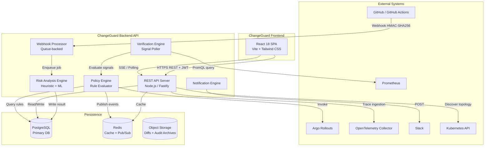
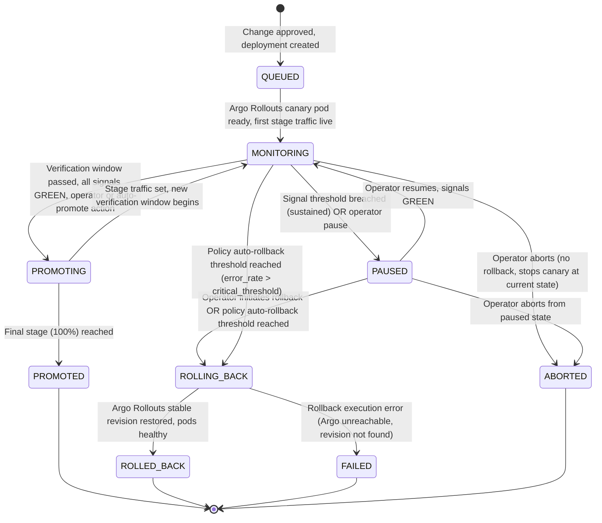

# ChangeGuard — Product Requirements Document

> **Status**: Draft v1.0 — Implementation Ready  
> **Date**: October 2026  
> **Authors**: Engineering Team (Document assembled from repository inspection)  
> **Source of Truth**: Repository at `c:\Users\User\Documents\changeguard-Major`

---

## Table of Contents

1. [Document Purpose, Status, Assumptions, and Terminology](#1-document-purpose-status-assumptions-and-terminology)
2. [Executive Summary and Product Vision](#2-executive-summary-and-product-vision)
3. [Problem Statement, Goals, Non-Goals, and Success Metrics](#3-problem-statement-goals-non-goals-and-success-metrics)
4. [Repository and Implementation-State Assessment](#4-repository-and-implementation-state-assessment)
5. [Stakeholders, Personas, Permissions, and User Journeys](#5-stakeholders-personas-permissions-and-user-journeys)
6. [Full Functional Requirements](#6-full-functional-requirements)
7. [Complete Page and Route Inventory](#7-complete-page-and-route-inventory)
8. [Target Architecture and Diagrams](#8-target-architecture-and-diagrams)
9. [Database Schema, Entity Relationships, and Data Lifecycle](#9-database-schema-entity-relationships-and-data-lifecycle)
10. [API Specifications and Representative Contracts](#10-api-specifications-and-representative-contracts)
11. [AI/ML, Risk Scoring, and Explainability Pipeline](#11-aiml-risk-scoring-and-explainability-pipeline)
12. [Deployment State Machine and Autonomous Safety Behavior](#12-deployment-state-machine-and-autonomous-safety-behavior)
13. [Security, Privacy, Reliability, and Non-Functional Requirements](#13-security-privacy-reliability-and-non-functional-requirements)
14. [Six-Phase Implementation Roadmap](#14-six-phase-implementation-roadmap)
15. [Testing Strategy and End-to-End Acceptance Criteria](#15-testing-strategy-and-end-to-end-acceptance-criteria)
16. [Deployment, Configuration, Observability, and Operations](#16-deployment-configuration-observability-and-operations)
17. [Risks, Technical Constraints, Assumptions, and Unresolved Decisions](#17-risks-technical-constraints-assumptions-and-unresolved-decisions)
18. [Final Definition of Done](#18-final-definition-of-done)

---

## 1. Document Purpose, Status, Assumptions, and Terminology

### 1.1 Purpose

This document is the single implementation authority for the ChangeGuard platform. It describes what must be built, why, and how — from the current repository state through a production-ready, enterprise-grade system. It is written for developers, architects, SREs, and AI coding agents who will implement the platform without repeated clarification.

### 1.2 Document Status

| Field | Value |
|---|---|
| Status | Draft v1.0 — Ready for team review |
| Repository | `changeguard-Major` (verified October 2026) |
| Frontend State | Functional demo with simulated data — **no production backend** |
| Backend State | **Does not exist**. All service calls resolve against in-memory mock data |
| Database | **Does not exist**. Proposed in this document |
| ML/AI Pipeline | **Does not exist**. Heuristic scoring defined in mock data; pipeline specified here |

### 1.3 Assumptions

- The team has access to a Kubernetes cluster for staging and production.
- GitHub is the primary VCS. Other VCS providers are out of scope for Phase 1-2.
- The frontend stack is preserved as-is; no migration to a different UI framework is required.
- A single-tenant multi-environment deployment model is used initially (one organization per installation).
- Multi-tenant (SaaS) isolation is a Phase 6 decision, not a Phase 1 requirement.
- Proprietary source code sent to any external AI model for analysis must use zero-data-retention API contracts. If such a contract cannot be established, local/self-hosted embedding models must be used.

### 1.4 Terminology

| Term | Definition |
|---|---|
| **Change** | A GitHub Pull Request, commit, or infrastructure modification ingested by ChangeGuard |
| **Risk Score** | 0–100 integer produced by the Risk Analysis Engine; higher = more dangerous |
| **Risk Level** | `LOW` (<40), `MEDIUM` (40–69), `HIGH` (70–89), `CRITICAL` (≥90) |
| **Canary** | A staged rollout exposing a fraction of production traffic to the new version |
| **Verification Signal** | A named telemetry metric with a pass/fail threshold evaluated during a rollout |
| **Blast Radius** | The set of services, databases, and users potentially affected by a failing change |
| **Baseline Revision** | The last known-good deployed version of a service |
| **Policy Engine** | The backend component that evaluates rules and autonomously acts on rollouts |
| **Simulation** | Demo-mode state mutations using in-memory mock data — not real infrastructure |
| **DORA Metrics** | Deployment Frequency, Lead Time, Change Failure Rate, MTTR (per the DORA research program) |
| **MTTD** | Mean Time to Detect a degradation |
| **MTTR** | Mean Time to Recover from an incident |

---

## 2. Executive Summary and Product Vision

### 2.1 What ChangeGuard Is

ChangeGuard is an **AI-native software-change safety and progressive deployment control platform** that sits between CI/CD pipelines and production observability. It continuously answers:

- *How risky is this specific software change, and what explains the score?*
- *What rollout strategy and verification policy should be mandated?*
- *Is the canary behaving within configured safety thresholds right now?*
- *Should the system promote, pause, abort, or roll back — and why?*

### 2.2 Positioning

```
Developer / AI Coding Agent
          ↓
    GitHub PR / Commit
          ↓
  ChangeGuard Ingestion          ← Bridge: CI/CD ↔ Production
          ↓
   Change Risk Analysis
          ↓
 Release Policy Recommendation
          ↓
  Progressive Canary Rollout  (Argo Rollouts / Kubernetes)
          ↓
  Verification Engine         (Prometheus / OpenTelemetry)
          ↓
    ┌─────┴─────┐
    ↓           ↓
 PROMOTE    PAUSE / ROLLBACK
    ↓           ↓
 100% Live  Blast Radius Contained
          ↓
  Outcome History → Risk Calibration Loop
```

### 2.3 Product Vision Statement

> Prevent software-change-induced incidents before they affect users, through deterministic risk analysis, graduated traffic exposure, real-time telemetry verification, and autonomous safety responses — with complete forensic traceability of every action and decision.

---

## 3. Problem Statement, Goals, Non-Goals, and Success Metrics

### 3.1 Problem Statement

Engineering teams deploying frequently suffer from:

1. **No pre-deployment risk signal**: CI/CD tells you tests passed; it does not tell you if the change will break production.
2. **Binary deployments**: Changes go to 0% or 100% with no graduated exposure.
3. **Late anomaly detection**: Observability tools alert after the full user base is affected.
4. **Manual rollback latency**: Engineers manually intervene, extending blast radius duration.
5. **No change-to-incident traceability**: Postmortems cannot easily link incidents to specific commits.

### 3.2 Goals

| ID | Goal |
|---|---|
| G-01 | Provide an explainable 0–100 risk score for every ingested change before deployment |
| G-02 | Enforce policy-driven progressive rollout strategies based on risk level |
| G-03 | Detect telemetry threshold breaches during canary and act autonomously within seconds |
| G-04 | Maintain a complete, tamper-evident audit trail of all actions and decisions |
| G-05 | Visualize service dependency blast radius for every change |
| G-06 | Surface DORA metrics and risk calibration data to drive continuous improvement |
| G-07 | Connect to GitHub, Kubernetes, Argo Rollouts, Prometheus, OpenTelemetry, and Slack |

### 3.3 Non-Goals

- Replacing CI/CD (GitHub Actions, Jenkins). ChangeGuard is an additive safety layer.
- Replacing APM (Datadog, New Relic). ChangeGuard consumes telemetry; it does not replace it.
- Code review, linting, or automated code fixes. Risk scoring is read-only analysis.
- Full SaaS multi-tenancy in Phase 1–5. Planned for Phase 6 consideration.
- Mobile application.
- Guaranteed zero false positives or zero false negatives in risk scoring. These are measured and improved over time.

### 3.4 Measurable Success Metrics

| Metric | Target (to be confirmed with stakeholders) |
|---|---|
| Change Failure Rate reduction | ≥30% vs. baseline before ChangeGuard |
| MTTD for canary anomalies | <60 seconds from threshold breach to policy action |
| Blast radius containment | ≥90% of incidents contained to ≤5% traffic exposure |
| Audit log completeness | 100% of promote/pause/rollback actions recorded with actor, timestamp, reason |
| Risk score availability | Score available within 60 seconds of GitHub webhook receipt |
| False positive rate | <5% (changes blocked or paused that would have succeeded) |

---

## 4. Repository and Implementation-State Assessment

### 4.1 Verified Technology Stack

| Technology | Documented | Verified in Repo | Version |
|---|---|---|---|
| React | ✅ | ✅ | 18.3.1 |
| TypeScript | ✅ | ✅ | ~5.6.2 (strict mode enabled) |
| Vite | ✅ | ✅ | ^6.0.3 |
| Tailwind CSS | ✅ | ✅ | ^3.4.16 |
| React Router DOM | ✅ | ✅ | ^6.28.0 |
| Recharts | ✅ | ✅ | ^2.15.0 |
| Lucide React | ✅ | ✅ | ^0.468.0 |
| Framer Motion | ❌ (not in README) | ✅ | ^11.15.0 |
| clsx + tailwind-merge | ❌ | ✅ | ^2.1.1 / ^2.5.5 |
| React Context (SimulationContext) | ✅ | ✅ | — |

> **Note**: `framer-motion` is installed but its usage extent was not audited at component level. It should not be removed until component-level usage is confirmed.

### 4.2 Implementation Status by Feature Area

| Feature Area | Status | Notes |
|---|---|---|
| Application shell, sidebar, topbar, breadcrumbs | **Implemented** | `AppShell`, `Sidebar`, `Topbar`, `Breadcrumbs` all present |
| Command palette (Ctrl+K) | **Implemented** | `CommandPalette.tsx` — keyboard listener in `AppShell` |
| Notification center | **Implemented** | `NotificationCenter.tsx`, driven by `SimulationContext` |
| Dashboard KPIs + attention panel | **Implemented (mock data)** | `MetricCard`, `AttentionPanel`, `DeploymentSafetyChart` |
| Changes list + filters | **Implemented (mock data)** | `ChangeTable`, `ChangeFilters` |
| Change detail + risk analysis | **Implemented (mock data)** | Full risk panel, diff viewer, blast radius, policy card |
| Diff viewer (code + SQL) | **Implemented (mock data)** | `DiffViewer.tsx` with tab switching |
| Historical similarity | **Implemented (mock data)** | `HistoricalSimilarity.tsx` |
| Release policy card + approval | **Implemented (mock data)** | `ReleasePolicyCard.tsx` triggers `approveChangePolicy` |
| Deployments list | **Implemented (mock data)** | `DeploymentTable.tsx` |
| Deployment detail / control room | **Implemented (mock data)** | Full telemetry cards, signals, timeline, actions |
| Simulate failure injection | **Implemented (simulation)** | `simulateFailure()` in `SimulationContext` — NOT real |
| Promote / pause / rollback actions | **Implemented (simulation)** | State mutations in `SimulationContext`; not real Argo calls |
| Service catalog | **Implemented (mock data)** | `ServiceTable.tsx`, 6 mock services |
| Service detail + dependencies | **Implemented (mock data)** | `ServiceDependencies.tsx` |
| Impact graph (interactive) | **Implemented (mock data)** | `ImpactGraph.tsx` — custom SVG canvas rendering |
| Incidents list | **Implemented (mock data)** | `IncidentTable.tsx` |
| Incident detail + postmortem | **Implemented (mock data)** | `IncidentDetailPage` |
| Policies list + rule editor modal | **Implemented (mock data)** | `PolicyCard`, `PolicyEditorModal` with live rule add/delete |
| Analytics (DORA metrics + charts) | **Implemented (mock data)** | `DoraMetricsRow`, `AnalyticsCharts` — static mock values |
| Integrations list + config modals | **Implemented (mock data)** | `IntegrationCard`, `IntegrationConfigModal` |
| Audit log | **Implemented (simulation)** | Populated by `SimulationContext` actions; not persisted |
| Settings (all 6 sub-pages) | **Implemented (UI only)** | Forms present; no backend persistence |
| Backend API | **Does not exist** | Service layer wraps mock data, comments note future REST |
| Database | **Does not exist** | No schema, no ORM, no migrations |
| GitHub webhook ingestion | **Does not exist** | Mock changes are hand-authored |
| Argo Rollouts integration | **Does not exist** | Simulated in `SimulationContext` |
| Prometheus / OTel integration | **Does not exist** | Telemetry is hand-authored mock data |
| Slack notifications | **Does not exist** | Listed in integration mock; no real dispatch |
| Risk scoring engine | **Does not exist** | Risk scores are authored in `mockChanges.ts` |
| Authentication / RBAC | **Does not exist** | No auth, no session, no token |

### 4.3 Source-Documentation Conflicts

| Item | README/Docs Claim | Repository Reality |
|---|---|---|
| "Immutable audit log" | Claimed in README | Mutable in-memory array; no persistence or immutability |
| "Live telemetry" | Implied by dashboard | Static mock snapshots + simulation state mutations |
| "Argo Rollouts triggered" | Timeline entries say so | Simulation only; no actual Argo API calls |
| "Policy Engine enforces" | Stated in UI copy | Frontend simulation; no backend enforcement |
| `framer-motion` | Not mentioned | Installed dependency |

---

## 5. Stakeholders, Personas, Permissions, and User Journeys

### 5.1 Stakeholders

| Stakeholder | Interest |
|---|---|
| Platform Engineering Teams | Building and maintaining the deployment infrastructure |
| SRE / On-Call Engineers | Incident investigation, rollback decisions, reliability targets |
| Developers | Understanding their change's risk, getting unblocked quickly |
| Engineering Managers | Visibility into deployment health and DORA trends |
| Security Teams | Audit trail integrity, RBAC enforcement, credential management |
| Administrators | Organization config, team management, integration setup |

### 5.2 User Personas and Roles

| Role | Permissions |
|---|---|
| **Admin** | Full access to all features, settings, team management, policy creation, credentials |
| **Platform Engineer** | Create/edit policies, approve changes, manage integrations, view all data |
| **SRE** | Promote/pause/rollback deployments, manage incidents, view all data, cannot modify policies |
| **Developer** | View changes and deployments for their services, approve own changes (if authorized), read-only elsewhere |
| **Approver** (assigned per policy) | Grant or deny approval gates; cannot modify policies or execute rollbacks outside their scope |

### 5.3 RBAC Permission Matrix

| Action | Admin | Platform Eng | SRE | Developer | Approver |
|---|---|---|---|---|---|
| View all changes/deployments/services | ✅ | ✅ | ✅ | Own services | ✅ |
| Approve release policy | ✅ | ✅ | ❌ | ❌ | ✅ |
| Promote deployment | ✅ | ✅ | ✅ | ❌ | ❌ |
| Pause deployment | ✅ | ✅ | ✅ | ❌ | ❌ |
| Rollback deployment | ✅ | ✅ | ✅ | ❌ | ❌ |
| Create/edit policies | ✅ | ✅ | ❌ | ❌ | ❌ |
| Manage team/RBAC | ✅ | ❌ | ❌ | ❌ | ❌ |
| Configure integrations | ✅ | ✅ | ❌ | ❌ | ❌ |
| View audit log | ✅ | ✅ | ✅ | ❌ | ❌ |
| Export audit log | ✅ | ✅ | ❌ | ❌ | ❌ |
| Manage AI settings | ✅ | ✅ | ❌ | ❌ | ❌ |

### 5.4 User Journeys

**Journey 1 — Developer submits a high-risk PR**
1. Developer opens a PR against `main` in GitHub.
2. ChangeGuard receives the webhook, runs analysis, posts a risk score back to the PR check.
3. Developer sees risk score 78/100 and a canary recommendation in the ChangeGuard dashboard.
4. Developer reviews the blast radius and risk factors.
5. Platform Engineer approves the release policy.
6. Deployment begins automatically, starting at 5% canary traffic.

**Journey 2 — Automated failure containment**
1. Canary is at 25% traffic; error rate climbs to 3.7% (policy threshold: <1.0%).
2. Policy Engine detects breach, pauses the rollout within seconds.
3. SRE receives Slack alert and a notification in ChangeGuard.
4. SRE reviews telemetry, confirms rollback is warranted.
5. SRE executes rollback from the Deployment Control Room.
6. Rollback completes; audit entry records actor, timestamp, reason, and before/after state.

**Journey 3 — SRE investigates a post-mortem**
1. SRE navigates to `Incidents → INC-482`.
2. Reviews root cause analysis, peak metrics, blast radius, linked change (`pr-1824`), and deployment (`dep-checkout-284`).
3. Opens audit log, exports the forensic timeline.
4. Creates a postmortem document linked to the incident.

**Journey 4 — Platform Engineer manages policies**
1. Platform Engineer navigates to `Policies`.
2. Opens the Production Safety Policy editor.
3. Adjusts the error-rate pause threshold from 2.0% to 1.5%.
4. Saves the change; the audit log records the update.
5. New threshold is enforced on the next canary deployment.

---

## 6. Full Functional Requirements

Requirements use the format `FR-AREA-NNN`.

### 6.A Application Shell and Dashboard

| ID | Requirement |
|---|---|
| FR-SHL-001 | The application shell MUST consist of a collapsible sidebar, a persistent topbar, a main content area, and a command palette overlay |
| FR-SHL-002 | The sidebar MUST be collapsible to an icon-only rail (68 px) and expandable to full width (240 px), with state persisted in `localStorage` |
| FR-SHL-003 | The sidebar MUST display nav groups: Core (Dashboard), Change Intelligence (Changes), Deployments, Reliability (Services, Incidents, Impact Graph), Governance (Policies, Analytics, Integrations, Audit Log), Settings |
| FR-SHL-004 | The topbar MUST display: current environment selector (`PRODUCTION` / `STAGING` / `DEVELOPMENT`), global search trigger, notification bell with unread count badge, user avatar, and demo reset button |
| FR-SHL-005 | A command palette MUST open on `Ctrl+K` / `Cmd+K`, support fuzzy search across changes, deployments, services, incidents, and navigation items, and close on `Escape` |
| FR-SHL-006 | The notification center MUST show a slide-over panel with typed notifications (`INFO`, `SUCCESS`, `WARNING`, `DANGER`), mark-as-read, and clear-all actions |
| FR-SHL-007 | Breadcrumbs MUST render the current navigation path and link to each ancestor |
| FR-SHL-008 | The dashboard MUST display a KPI row with: Deployment Risk (average), Active Rollouts, Blocked Changes, Change Failure Rate |
| FR-SHL-009 | The dashboard MUST display an Attention Panel listing the highest-priority items (high-risk changes, active incidents, paused deployments) with direct action links |
| FR-SHL-010 | The dashboard MUST display a 30-day deployment velocity chart with successful, failed, rollback, and blocked counts |
| FR-SHL-011 | The dashboard MUST display an Active Rollouts table showing in-progress canary deployments with status, traffic percentage, and health |
| FR-SHL-012 | The dashboard MUST display a Recent Changes list with the last 5 ingested changes and their risk levels |
| FR-SHL-013 | Every list/detail page MUST render a loading skeleton, an error state with retry, and an empty state with contextual guidance |
| FR-SHL-014 | The demo reset button MUST restore all simulation state to its documented initial values without requiring a page reload |

### 6.B Change Ingestion and Intelligence

| ID | Requirement |
|---|---|
| FR-CHG-001 | The backend MUST ingest GitHub pull request events (`opened`, `synchronize`, `reopened`, `closed`) via a verified webhook endpoint |
| FR-CHG-002 | The backend MUST verify GitHub webhook HMAC-SHA256 signatures before processing any payload |
| FR-CHG-003 | Change records MUST store: PR number, title, author, repository, source/target branches, commit hash, file diff, additions/deletions count, CI status, labels, and timestamps |
| FR-CHG-004 | The Risk Analysis Engine MUST produce a 0–100 integer score for every change, accompanied by: risk level (`LOW`/`MEDIUM`/`HIGH`/`CRITICAL`), confidence percentage, summary, and ordered list of contributing risk factors |
| FR-CHG-005 | Risk factor scores MUST be individually explainable with: factor name, score, weight, description, and ≥1 evidence detail |
| FR-CHG-006 | Risk level boundaries MUST be: LOW 0–39, MEDIUM 40–69, HIGH 70–89, CRITICAL 90–100 |
| FR-CHG-007 | The system MUST detect SQL migration files in the diff and classify hazards including: `DROP TABLE`, `DROP COLUMN`, `ALTER TABLE ... DROP`, index creation without `CONCURRENTLY`, non-nullable column additions, and foreign key additions without deferral |
| FR-CHG-008 | The system MUST detect and flag changes to security-sensitive files (TLS configuration, cipher suite lists, authentication flows, secrets management) |
| FR-CHG-009 | The system MUST compute a blast-radius assessment identifying: directly changed service, downstream service dependencies, database dependencies, estimated concurrent users affected, and blast radius score per affected service |
| FR-CHG-010 | The system MUST surface historically similar changes using structural similarity features; each similar result MUST include: PR number, title, similarity percentage, outcome (`SUCCESSFUL`/`ROLLBACK`/`INCIDENT`/`PAUSED`), and summary |
| FR-CHG-011 | The system MUST emit a release policy recommendation with: strategy (`CANARY`/`BLUE_GREEN`/`ROLLING`/`STAGED`), stage percentages, verification window duration, required signals with thresholds, human approval requirement, and reason |
| FR-CHG-012 | Risk analysis MUST complete and be available for query within 60 seconds of webhook receipt |
| FR-CHG-013 | If the risk analysis engine fails or returns no result, the change MUST be assigned a conservative default score of 75 with a confidence of 0 and a warning flag, and must NOT be silently treated as low-risk |
| FR-CHG-014 | The Changes list MUST support filtering by: risk level, status, change type (`PULL_REQUEST`/`COMMIT`/`INFRASTRUCTURE`/`AI_GENERATED`), repository, author, and date range |
| FR-CHG-015 | The Change Detail view MUST display: risk score panel, ordered risk factors (expandable), AI analysis text, impact/blast radius section, diff viewer with file tabs and SQL/DDL tab, historical similarity list, and release policy card |
| FR-CHG-016 | Approval of a release policy MUST be recorded in the audit log with: actor identity, timestamp, change ID, strategy approved, and verification thresholds |
| FR-CHG-017 | Changes with status `POLICY_BLOCKED` MUST have a clear block reason displayed and MUST NOT be promotable without explicit Admin or Platform Engineer override |

### 6.C Release Policy and Governance

| ID | Requirement |
|---|---|
| FR-POL-001 | Policies MUST be stored as named, versioned rule sets with: name, description, environment scope, tier scope, status (`ACTIVE`/`DRAFT`/`PAUSED`), enforcement mode (`ENFORCING`/`DRY_RUN`), owner, and audit timestamps |
| FR-POL-002 | Each policy rule MUST have: condition name, field, operator, threshold value, unit, action, action description, and enabled flag |
| FR-POL-003 | Supported policy actions MUST include: `REQUIRE_HUMAN_APPROVAL`, `REQUIRE_CANARY`, `PAUSE_ROLLOUT`, `ROLLBACK_DEPLOYMENT`, `BLOCK_MERGE`, `RESTRICT_OFF_PEAK_ONLY` |
| FR-POL-004 | Supported rule fields MUST include at minimum: `risk_score`, `error_rate`, `p95_latency`, `has_db_migration`, `change_size_lines`, `p95_latency_increase`, `freeze_window_active`, `container_restart_count`, `test_coverage` |
| FR-POL-005 | Policy enforcement MUST occur on the backend. Frontend controls MAY reflect policy state but MUST NOT substitute for backend enforcement |
| FR-POL-006 | Policies in `DRY_RUN` mode MUST evaluate rules and log what actions would have been taken without executing those actions |
| FR-POL-007 | The Policy Editor Modal MUST allow: creating a new policy, editing rules (add, modify threshold, enable/disable, delete), previewing estimated impact, and saving with validation |
| FR-POL-008 | Saving a policy MUST create a versioned snapshot. Previous policy versions MUST be queryable from the audit log |
| FR-POL-009 | Two-person approval MUST be enforceable for: rollback of Tier-1 services, policy changes affecting all-environment scope, and any action on changes with risk score ≥ 90 (when configured) |
| FR-POL-010 | The system MUST enforce the configured release strategy when a policy-approved change is deployed, including: mandating canary stages, enforcing verification window durations, and blocking manual stage skipping unless authorized |
| FR-POL-011 | Freeze window rules MUST integrate with a configurable schedule and block deployments outside authorized maintenance windows |

### 6.D Progressive Deployment and Autonomous Response

| ID | Requirement |
|---|---|
| FR-DEP-001 | Deployments MUST be tracked through a defined state machine (see Section 12 for the full diagram) |
| FR-DEP-002 | The backend MUST integrate with Argo Rollouts via its Kubernetes CRD API to create, update, and observe `Rollout` resources |
| FR-DEP-003 | Canary deployments MUST support configurable stage percentages. The default staging used in the demo is `[5, 25, 50, 100]` |
| FR-DEP-004 | Each stage transition MUST be preceded by a configurable verification window. The default is 10 minutes for HIGH risk changes |
| FR-DEP-005 | The backend Verification Engine MUST poll configured Prometheus PromQL expressions at a configurable interval (default: 15 seconds) and evaluate each signal against its threshold |
| FR-DEP-006 | If a signal breach is sustained beyond the configured tolerance window (default: 60 seconds), the policy action MUST be triggered automatically without human input |
| FR-DEP-007 | Operators MUST be able to manually promote, pause, resume, abort, or rollback a deployment from the UI. Each action MUST display a confirmation dialog before execution |
| FR-DEP-008 | Rollback MUST instruct Argo Rollouts to set the stable revision as the active image. The system MUST verify rollback completion by polling pod readiness |
| FR-DEP-009 | All promote/pause/rollback/abort operations MUST be idempotent: repeating the same action on an already-in-that-state deployment MUST return the current state without side effects |
| FR-DEP-010 | Concurrent operator actions (e.g., two SREs clicking Rollback simultaneously) MUST be protected by an optimistic locking mechanism on the deployment record |
| FR-DEP-011 | The Deployment Detail (Control Room) page MUST display: rollout progress bar, current traffic percentage, stage indicator, live telemetry charts (error rate, latency, throughput, CPU, memory), verification signal statuses, deployment timeline, and action buttons |
| FR-DEP-012 | Live telemetry charts MUST plot at minimum: canary error rate, P95 latency, and throughput, overlaid with configurable threshold lines |
| FR-DEP-013 | The backend MUST dispatch a notification (in-app and Slack if configured) for: rollout paused, rollout promoted, rollout aborted, rollback completed, and rollout stage advanced |
| FR-DEP-014 | The Deployment List MUST support filtering by: status, strategy, service, risk level, and environment |
| FR-DEP-015 | Missing or stale telemetry (no data received for > configured staleness threshold) MUST be treated as a signal failure, not as passing, and MUST trigger the configured policy action for data absence |
| FR-DEP-016 | The simulation demo banner MUST clearly label itself as a simulation and MUST NOT appear in a production deployment without feature flag `DEMO_MODE=true` |

### 6.E Service Reliability and Topology

| ID | Requirement |
|---|---|
| FR-SVC-001 | The service catalog MUST store: name, slug, description, tier (`TIER_1`/`TIER_2`/`TIER_3`), owner (team, lead, Slack channel), repository, environment, health, risk score, uptime percentage, deployment counts, incident counts, last deployment info, and current telemetry |
| FR-SVC-002 | Each service record MUST list upstream dependents and downstream dependencies with: ID, name, type (`SERVICE`/`DATABASE`/`QUEUE`/`API_GATEWAY`/`CACHE`/`THIRD_PARTY`), direction, health, and protocol |
| FR-SVC-003 | The Service Catalog list MUST support filtering by: tier, health, risk level, environment, and owner team |
| FR-SVC-004 | The Service Detail page MUST display: health metrics, current telemetry, dependency graph, active and recent deployments, and incident history |
| FR-SVC-005 | The Impact Graph MUST render a layered, interactive visualization of all services, databases, queues, caches, and third-party connectors with edges labeled by protocol and traffic volume |
| FR-SVC-006 | Nodes on the Impact Graph MUST be color-coded by health status. High-risk propagation paths MUST be highlighted distinctly (e.g., orange-tinted edges) |
| FR-SVC-007 | Clicking a node on the Impact Graph MUST open an inspector panel showing: node details, owner, tier, risk score, last deployment, incident count, and its direct dependencies/dependents |
| FR-SVC-008 | The Impact Graph MUST have a filter to highlight the blast radius of a selected change or deployment |
| FR-SVC-009 | Topology data MUST be refreshed from service-discovery sources. In the backend, the refresh interval MUST be configurable (default: 5 minutes) |
| FR-SVC-010 | Missing or uncertain dependency information MUST be indicated visually (e.g., a dashed edge with a "dependency unverified" tooltip) |

### 6.F Incident Management and Audit

| ID | Requirement |
|---|---|
| FR-INC-001 | Incidents MUST be stored with: code (e.g., `INC-482`), title, severity (`SEV-1`/`SEV-2`/`SEV-3`/`SEV-4`), status (`TRIGGERED`/`INVESTIGATING`/`MITIGATING`/`CONTAINED`/`RESOLVED`), start/end times, affected services, linked deployment, linked change, root cause analysis, peak metrics, and timeline |
| FR-INC-002 | Incidents MUST be automatically created when the Policy Engine executes an autonomous pause or rollback due to a telemetry breach |
| FR-INC-003 | Incidents MUST link to: the causal change (PR/commit), the related deployment, and affected services |
| FR-INC-004 | The Incident Detail page MUST display: severity badge, status, duration, affected services, root cause analysis, timeline of events, linked entities, and actions taken |
| FR-INC-005 | The incident timeline MUST distinguish automatic actions (Policy Engine) from operator actions (user-initiated), with actor identity recorded for each |
| FR-INC-006 | Postmortem data MUST include: RCA summary, trigger mechanism, blast containment explanation, and preventative recommendation |
| FR-INC-007 | The Incident List MUST support filtering by: severity, status, affected service, and time range |
| FR-INC-008 | Audit events MUST be written for every security-sensitive or operationally significant action: change approval, policy modification, deployment promote/pause/rollback/abort, integration configuration change, user role modification, API key issuance/revocation |
| FR-INC-009 | Each audit event MUST store: unique ID, ISO 8601 timestamp, actor (name, type, email if user), action type, action title, resource (type, ID, name), result (`SUCCESS`/`WARNING`/`FAILED`), source, and free-text details |
| FR-INC-010 | Audit events MUST be append-only in the database (no UPDATE or DELETE allowed on audit rows; enforced at the application layer and, where possible, at the database layer via triggers or immutable storage) |
| FR-INC-011 | The Audit Log UI MUST support filtering by: action type, actor, resource type, result, and date range. It MUST support export to CSV |
| FR-INC-012 | Audit log retention MUST be configurable (default: 1 year). Rows beyond the retention window MAY be archived, but MUST NOT be deleted without an authorized admin action that itself is audited |

### 6.G Analytics

| ID | Requirement |
|---|---|
| FR-ANL-001 | The Analytics page MUST display DORA metrics: Deployment Frequency (deployments/day, rolling 30 days), Change Failure Rate (failed+rolled-back / total), MTTD, and MTTR |
| FR-ANL-002 | DORA metric formulas: **Deployment Frequency** = total deployments / 30 days; **CFR** = (failed_deployments + rollbacks) / total_deployments × 100; **MTTD** = mean(incident_first_alert_time - deployment_start_time); **MTTR** = mean(incident_resolved_time - incident_triggered_time) |
| FR-ANL-003 | The Analytics page MUST display: a 30-day deployment volume chart (stacked by outcome), a risk distribution pie/bar chart, and a per-service failure rate table |
| FR-ANL-004 | Analytics MUST support time-range filtering: 7 days, 30 days, 90 days |
| FR-ANL-005 | When historical records are insufficient to compute a metric, the system MUST display "Insufficient data" rather than inventing a value |
| FR-ANL-006 | The system MUST track false-positive rate: cases where a deployment was paused or blocked but would have succeeded. This requires outcome collection and manual or heuristic labeling |
| FR-ANL-007 | Risk calibration data MUST be displayed as a scatter or histogram showing predicted risk score vs. actual outcome (rollback, incident, success) to allow the team to identify score accuracy trends |

### 6.H Integrations

| ID | Requirement |
|---|---|
| FR-INT-001 | **GitHub**: Connect via GitHub App or OAuth token. Receive `pull_request`, `push`, and `check_run` webhook events. Post PR status checks back with risk score. Support 1–N repositories per organization |
| FR-INT-002 | **GitHub Actions**: Receive workflow run completion events; ingest CI pass/fail status as a risk factor input |
| FR-INT-003 | **Kubernetes**: Connect via kubeconfig or ServiceAccount. Discover services, namespaces, and pod health. Used for blast-radius and topology discovery |
| FR-INT-004 | **Argo Rollouts**: Connect via Argo Rollouts REST API or kubectl. Create, update, promote, pause, and rollback `Rollout` CRDs. Receive status webhooks or poll for state changes |
| FR-INT-005 | **Prometheus**: Connect via HTTP API. Execute configurable PromQL expressions to fetch verification signal values during rollouts |
| FR-INT-006 | **OpenTelemetry**: Ingest distributed trace data to map service dependency graphs and identify inter-service latency patterns |
| FR-INT-007 | **Slack**: Send notifications to configured channels for high-risk changes, automated pauses, rollbacks, and approval requests. Use Slack Block Kit for actionable messages |
| FR-INT-008 | **Jira** (optional): Link PR/change records to Jira tickets by matching branch names or commit message references. Status `DISCONNECTED` until configured |
| FR-INT-009 | Every integration configuration MUST store credentials encrypted at rest (AES-256 or KMS-backed). Plaintext credentials MUST never appear in logs, API responses, or the UI |
| FR-INT-010 | Every integration MUST expose a connection test button that verifies reachability and authentication without executing a write operation |
| FR-INT-011 | Integration status MUST reflect real connection state: `CONNECTED`, `DISCONNECTED`, `ERROR`, `CONFIGURING`. Last sync timestamp MUST be displayed |
| FR-INT-012 | Integration webhooks MUST implement exponential backoff retry (max 5 retries, max 30-second interval) and MUST log each failure |
| FR-INT-013 | Rate limit responses from external APIs MUST be handled gracefully (respect `Retry-After` header) and surfaced to operators via integration status |

### 6.I Settings and Administration

| ID | Requirement |
|---|---|
| FR-SET-001 | **General Settings**: Organization name, logo, default environment, timezone, contact email, theme (light only per design spec) |
| FR-SET-002 | **Team Settings**: List team members with name, email, role. Invite new members by email. Change roles. Remove members. Roles: Admin, Platform Engineer, SRE, Developer, Approver |
| FR-SET-003 | **Security Settings**: Configure SAML/Okta SSO (metadata URL, entity ID, ACS URL). Enable/disable two-person approval gates. Manage API keys (name, masked key, created date, last used, revoke) |
| FR-SET-004 | **Environment Settings**: Configure Kubernetes cluster bindings per environment. Each cluster config stores: name, kubeconfig reference (not plaintext), namespace, and health status |
| FR-SET-005 | **Notification Settings**: Configure notification channels (Slack webhook URL, email), delivery rules (which events trigger which channels), and quiet hours |
| FR-SET-006 | **AI Settings**: Configure risk engine heuristics (enable/disable individual risk factors, adjust weights), similarity analysis settings (embedding model version, similarity threshold), and data retention controls (whether change diffs are stored and for how long) |
| FR-SET-007 | All settings changes MUST be persisted to the backend and MUST generate audit events |
| FR-SET-008 | API key secrets MUST be displayed exactly once at creation. Subsequent views MUST show only the masked key. Revocation MUST immediately invalidate the key |
| FR-SET-009 | SAML SSO configuration MUST be validated against the IdP metadata before activation. A test-login flow MUST be available before enabling SSO as the primary login method |

---

## 7. Complete Page and Route Inventory

All routes exist in `src/routes/AppRoutes.tsx` and are verified against the actual router configuration.

| Route | Page Component | Purpose | Primary Roles | Key Interactions | API Dependencies |
|---|---|---|---|---|---|
| `/dashboard` | `DashboardPage` | Command center: KPIs, attention panel, active rollouts, deployment trend chart, recent changes | All | Click attention items, navigate to changes/deployments | `GET /api/analytics`, `GET /api/changes?limit=5`, `GET /api/deployments?status=active` |
| `/changes` | `ChangesPage` | Ingested change list with risk scores, filters, status badges | All | Filter, search, click to detail | `GET /api/changes` |
| `/changes/:id` | `ChangeDetailPage` | Full risk analysis: score panel, risk factors, AI analysis, diff viewer, blast radius, historical similarity, policy card, approve action | Platform Eng, Approver, SRE (view) | Approve policy, explore diff tabs, view blast radius | `GET /api/changes/:id`, `POST /api/changes/:id/approve` |
| `/deployments` | `DeploymentsPage` | Progressive delivery pipelines with status, strategy, traffic %, health | All | Filter, click to control room | `GET /api/deployments` |
| `/deployments/:id` | `DeploymentDetailPage` | Production Control Room: rollout progress, live telemetry, verification signals, timeline, action buttons | All (actions: SRE+) | Promote, Pause, Rollback, Abort; view telemetry chart | `GET /api/deployments/:id`, `POST /api/deployments/:id/promote`, `/pause`, `/rollback`, `/abort` |
| `/services` | `ServicesPage` | Microservice catalog with uptime, owner, health, risk, active deployments | All | Filter, click to detail | `GET /api/services` |
| `/services/:id` | `ServiceDetailPage` | Service deep dive: telemetry, dependencies (upstream + downstream), deployment history, incident history | All | Click dependency to impact graph | `GET /api/services/:id` |
| `/incidents` | `IncidentsPage` | Production incidents list with severity, status, duration, affected services | All | Filter, click to detail | `GET /api/incidents` |
| `/incidents/:id` | `IncidentDetailPage` | Postmortem: RCA, timeline, peak metrics, linked change/deployment, actions taken | SRE, Platform Eng, Admin | Navigate to linked deployment/change | `GET /api/incidents/:id` |
| `/impact-graph` | `ImpactGraphPage` | Interactive service topology graph with node inspector, risk propagation highlighting | All | Click node to inspect, highlight blast radius of selected change | `GET /api/impact-graph` |
| `/policies` | `PoliciesPage` | Release guardrail policy list with status, environment scope, rule count | Platform Eng, Admin | Open editor modal, toggle enforcement mode | `GET /api/policies`, `PATCH /api/policies/:id` |
| `/analytics` | `AnalyticsPage` | DORA metrics row, 30-day deployment chart, risk distribution, service failure rates | All | Filter by time range | `GET /api/analytics` |
| `/integrations` | `IntegrationsPage` | Connector status grid: GitHub, Argo, K8s, Prometheus, OTel, Slack, Jira | Admin, Platform Eng | Open config modal, test connection | `GET /api/integrations`, `PUT /api/integrations/:id` |
| `/audit-log` | `AuditLogPage` | Append-only forensic event list | Admin, Platform Eng, SRE | Filter by type/actor/resource, export CSV | `GET /api/audit-log` |
| `/settings` | `SettingsIndexPage` | Settings index/redirect | Admin | Navigate to sub-settings | — |
| `/settings/general` | `GeneralSettings` | Organization config | Admin | Save org details | `GET/PUT /api/settings/general` |
| `/settings/team` | `TeamSettings` | Team members, roles, invites | Admin | Invite, change role, remove | `GET/POST/PATCH/DELETE /api/team` |
| `/settings/security` | `SecuritySettings` | SSO config, two-person approval, API keys | Admin | Configure SSO, create/revoke API keys | `GET/POST/DELETE /api/settings/security` |
| `/settings/environments` | `EnvironmentSettings` | Kubernetes cluster bindings | Admin, Platform Eng | Add/edit/remove clusters | `GET/POST/PATCH/DELETE /api/settings/environments` |
| `/settings/notifications` | `NotificationSettings` | Notification channels and rules | Admin, Platform Eng | Add Slack webhook, configure rules | `GET/PUT /api/settings/notifications` |
| `/settings/ai` | `AiSettings` | Risk engine configuration, model settings, data retention | Admin, Platform Eng | Toggle risk factors, set weights, set retention | `GET/PUT /api/settings/ai` |

### 7.1 Missing Route from Documented Inventory

The documented route inventory is fully matched by `AppRoutes.tsx`. No routes are missing. No duplicate routes exist.

> **Note**: There is no `/settings/ai` equivalence to a model training page. AI settings configure heuristic weights and retention policies only; they do not expose model training controls (no training pipeline exists yet).

---

## 8. Target Architecture and Diagrams

### 8.1 Architecture Overview

> **Clarification**: The existing repository contains only the frontend. The following describes the complete **target architecture** — none of the backend, database, or integration components exist yet. They are proposed and must be implemented.



### 8.2 Component Responsibilities

| Component | Responsibility |
|---|---|
| **React SPA** | All UI rendering, state display, user interactions, command palette, notifications |
| **REST API Server** | Request validation, authentication/authorization, business logic orchestration, response formatting |
| **Webhook Processor** | Receive, validate (HMAC), deduplicate, and enqueue GitHub events. Idempotency key: `delivery_id` from GitHub header |
| **Risk Analysis Engine** | Parse diffs, extract features, compute risk score, produce factors and explanations |
| **Policy Engine** | Load active rules, evaluate conditions against change/deployment state, execute configured actions |
| **Verification Engine** | Poll Prometheus at configurable intervals during active rollouts, evaluate signals, notify Policy Engine on breach |
| **Notification Engine** | Dispatch in-app notifications, Slack messages, and email alerts based on events |
| **PostgreSQL** | Primary persistence for all domain entities |
| **Redis** | Session cache, rate-limit counters, pub/sub for real-time events, webhook dedup cache |
| **Object Storage (S3/compatible)** | Store raw git diffs, audit log archives, postmortem documents |

### 8.3 Recommended Backend Technology

> **PROPOSED DECISION**: Not yet established in the repository.

**Recommendation**: **Node.js with Fastify + TypeScript**

**Rationale**:
- The existing codebase is TypeScript. Sharing types between frontend and backend (via a shared `packages/` monorepo or npm workspace) reduces drift between the API contract and UI models.
- Fastify is significantly faster than Express for high-throughput webhook processing and has native TypeScript support.
- The team already knows TypeScript; no new language learning is required.
- Fastify has a robust plugin ecosystem for JWT auth, rate limiting, schema validation (AJV), and Prometheus metrics.

**Alternative considered**: Python (FastAPI). Rejected because it introduces a second language and makes type sharing with the frontend harder.

### 8.4 API Design Recommendation

> **PROPOSED DECISION**: REST is recommended for Phase 1-3. gRPC may be added for internal service-to-service communication (Verification Engine → Policy Engine) in Phase 4-5.

**Rationale**: The frontend service layer is designed around REST-shaped function calls. The documented future API contracts are all REST. gRPC adds complexity without benefit for browser-to-server communication.

### 8.5 Key Data Flows

**Change Ingestion Flow**:
```
GitHub PR event → Webhook endpoint (HMAC verify) → 
Dedup check (Redis) → Enqueue risk analysis job → 
Diff parser → Feature extractor → Risk scorer → 
Write change record + risk result to DB → 
Emit notification → Post GitHub PR status check
```

**Autonomous Rollback Flow**:
```
Verification Engine polls Prometheus (every 15s) → 
Signal threshold breached → Sustained for 60s → 
Policy Engine evaluates rules → PAUSE_ROLLOUT action → 
Argo Rollouts API call (pause) → 
Write audit event → Create incident → 
Emit notification (in-app + Slack)
```

### 8.6 Trust Boundaries

| Boundary | Controls |
|---|---|
| Browser → API | HTTPS, JWT bearer token, CSRF protection |
| API → Database | Internal network only, connection pool with credentials in secrets manager |
| API → Argo Rollouts | mTLS or service account token, minimum required RBAC |
| API → Prometheus | Internal network, read-only token |
| GitHub → Webhook endpoint | HMAC-SHA256 signature verification |
| API → Slack | Bot token in secrets manager, HTTPS only |

---

## 9. Database Schema, Entity Relationships, and Data Lifecycle

> **Status**: Proposed. No database exists in the current repository.  
> **Recommended RDBMS**: PostgreSQL 16+

### 9.1 Core Schema

```sql
-- Organizations
CREATE TABLE organizations (
  id           UUID PRIMARY KEY DEFAULT gen_random_uuid(),
  name         TEXT NOT NULL,
  slug         TEXT UNIQUE NOT NULL,
  created_at   TIMESTAMPTZ NOT NULL DEFAULT NOW(),
  updated_at   TIMESTAMPTZ NOT NULL DEFAULT NOW()
);

-- Users
CREATE TABLE users (
  id              UUID PRIMARY KEY DEFAULT gen_random_uuid(),
  organization_id UUID NOT NULL REFERENCES organizations(id),
  name            TEXT NOT NULL,
  email           TEXT UNIQUE NOT NULL,
  role            TEXT NOT NULL CHECK (role IN ('ADMIN','PLATFORM_ENGINEER','SRE','DEVELOPER','APPROVER')),
  is_active       BOOLEAN NOT NULL DEFAULT TRUE,
  sso_subject     TEXT,                    -- SAML NameID
  created_at      TIMESTAMPTZ NOT NULL DEFAULT NOW(),
  updated_at      TIMESTAMPTZ NOT NULL DEFAULT NOW()
);
CREATE INDEX idx_users_org ON users(organization_id);

-- API Keys
CREATE TABLE api_keys (
  id              UUID PRIMARY KEY DEFAULT gen_random_uuid(),
  organization_id UUID NOT NULL REFERENCES organizations(id),
  user_id         UUID REFERENCES users(id),
  name            TEXT NOT NULL,
  key_hash        TEXT NOT NULL,           -- bcrypt hash of the key
  key_prefix      TEXT NOT NULL,           -- first 8 chars for display
  last_used_at    TIMESTAMPTZ,
  revoked_at      TIMESTAMPTZ,
  created_at      TIMESTAMPTZ NOT NULL DEFAULT NOW()
);

-- Services
CREATE TABLE services (
  id                      UUID PRIMARY KEY DEFAULT gen_random_uuid(),
  organization_id         UUID NOT NULL REFERENCES organizations(id),
  name                    TEXT NOT NULL,
  slug                    TEXT NOT NULL,
  description             TEXT,
  tier                    TEXT NOT NULL CHECK (tier IN ('TIER_1','TIER_2','TIER_3')),
  owner_team              TEXT,
  owner_lead              TEXT,
  slack_channel           TEXT,
  repository              TEXT,
  tags                    TEXT[] DEFAULT '{}',
  created_at              TIMESTAMPTZ NOT NULL DEFAULT NOW(),
  updated_at              TIMESTAMPTZ NOT NULL DEFAULT NOW(),
  UNIQUE(organization_id, slug)
);

-- Service Dependencies
CREATE TABLE service_dependencies (
  id              UUID PRIMARY KEY DEFAULT gen_random_uuid(),
  source_id       UUID NOT NULL REFERENCES services(id),
  target_id       UUID NOT NULL REFERENCES services(id),
  dep_type        TEXT NOT NULL CHECK (dep_type IN ('SERVICE','DATABASE','QUEUE','API_GATEWAY','CACHE','THIRD_PARTY')),
  protocol        TEXT,
  verified_at     TIMESTAMPTZ,
  UNIQUE(source_id, target_id)
);

-- Changes (PRs / Commits)
CREATE TABLE changes (
  id                      UUID PRIMARY KEY DEFAULT gen_random_uuid(),
  organization_id         UUID NOT NULL REFERENCES organizations(id),
  external_id             TEXT NOT NULL,           -- GitHub PR number or commit SHA
  type                    TEXT NOT NULL CHECK (type IN ('PULL_REQUEST','COMMIT','INFRASTRUCTURE','AI_GENERATED')),
  title                   TEXT NOT NULL,
  repository              TEXT NOT NULL,
  source_branch           TEXT,
  target_branch           TEXT,
  commit_hash             TEXT,
  author_name             TEXT,
  author_username         TEXT,
  author_email            TEXT,
  is_ai_agent             BOOLEAN DEFAULT FALSE,
  files_changed_count     INTEGER DEFAULT 0,
  additions               INTEGER DEFAULT 0,
  deletions               INTEGER DEFAULT 0,
  status                  TEXT NOT NULL DEFAULT 'AWAITING_REVIEW'
                          CHECK (status IN ('AWAITING_REVIEW','APPROVED','POLICY_BLOCKED','CANARY_RECOMMENDED','DEPLOYED','REJECTED')),
  environment             TEXT CHECK (environment IN ('PRODUCTION','STAGING','DEVELOPMENT')),
  pr_url                  TEXT,
  diff_stored_key         TEXT,                    -- S3/object storage key for raw diff
  created_at              TIMESTAMPTZ NOT NULL DEFAULT NOW(),
  updated_at              TIMESTAMPTZ NOT NULL DEFAULT NOW(),
  UNIQUE(organization_id, repository, external_id)
);
CREATE INDEX idx_changes_org ON changes(organization_id);
CREATE INDEX idx_changes_status ON changes(status);

-- Risk Analyses
CREATE TABLE risk_analyses (
  id                  UUID PRIMARY KEY DEFAULT gen_random_uuid(),
  change_id           UUID NOT NULL REFERENCES changes(id),
  score               SMALLINT NOT NULL CHECK (score BETWEEN 0 AND 100),
  level               TEXT NOT NULL CHECK (level IN ('LOW','MEDIUM','HIGH','CRITICAL')),
  confidence          SMALLINT CHECK (confidence BETWEEN 0 AND 100),
  summary             TEXT,
  overview            TEXT,
  technical_details   TEXT,
  identified_risks    TEXT[],
  recommendations     TEXT,
  model_version       TEXT,
  analyzed_at         TIMESTAMPTZ NOT NULL DEFAULT NOW()
);
CREATE UNIQUE INDEX idx_risk_analysis_change ON risk_analyses(change_id);

-- Risk Factors
CREATE TABLE risk_factors (
  id              UUID PRIMARY KEY DEFAULT gen_random_uuid(),
  analysis_id     UUID NOT NULL REFERENCES risk_analyses(id) ON DELETE CASCADE,
  factor_key      TEXT NOT NULL,
  name            TEXT NOT NULL,
  score           SMALLINT NOT NULL CHECK (score BETWEEN 0 AND 100),
  weight          TEXT NOT NULL CHECK (weight IN ('LOW','MEDIUM','HIGH','CRITICAL')),
  description     TEXT,
  details         TEXT[],
  sort_order      INTEGER
);
CREATE INDEX idx_risk_factors_analysis ON risk_factors(analysis_id);

-- Historical Similarity Records
CREATE TABLE historical_similarity (
  id                      UUID PRIMARY KEY DEFAULT gen_random_uuid(),
  analysis_id             UUID NOT NULL REFERENCES risk_analyses(id) ON DELETE CASCADE,
  reference_change_id     UUID REFERENCES changes(id),
  reference_external_id   TEXT NOT NULL,
  reference_title         TEXT,
  repository              TEXT,
  similarity_score        SMALLINT NOT NULL CHECK (similarity_score BETWEEN 0 AND 100),
  outcome                 TEXT CHECK (outcome IN ('SUCCESSFUL','ROLLBACK','INCIDENT','PAUSED')),
  summary                 TEXT,
  reference_date          DATE
);

-- Release Policy Recommendations (per analysis)
CREATE TABLE policy_recommendations (
  id                          UUID PRIMARY KEY DEFAULT gen_random_uuid(),
  analysis_id                 UUID NOT NULL REFERENCES risk_analyses(id) ON DELETE CASCADE,
  strategy                    TEXT NOT NULL CHECK (strategy IN ('CANARY','BLUE_GREEN','ROLLING','STAGED')),
  stages                      INTEGER[] NOT NULL,
  verification_window_minutes INTEGER NOT NULL DEFAULT 10,
  human_approval_required     BOOLEAN NOT NULL DEFAULT FALSE,
  approval_reason             TEXT,
  suggested_action            TEXT NOT NULL CHECK (suggested_action IN ('APPROVE_POLICY','MODIFY_POLICY','BLOCK')),
  approved_by                 UUID REFERENCES users(id),
  approved_at                 TIMESTAMPTZ
);

-- Policies
CREATE TABLE policies (
  id                  UUID PRIMARY KEY DEFAULT gen_random_uuid(),
  organization_id     UUID NOT NULL REFERENCES organizations(id),
  name                TEXT NOT NULL,
  description         TEXT,
  environment         TEXT NOT NULL CHECK (environment IN ('PRODUCTION','STAGING','ALL')),
  tier_scope          TEXT NOT NULL CHECK (tier_scope IN ('ALL','TIER_1_ONLY','CRITICAL_SERVICES')),
  status              TEXT NOT NULL DEFAULT 'DRAFT' CHECK (status IN ('ACTIVE','DRAFT','PAUSED')),
  enforcement_mode    TEXT NOT NULL DEFAULT 'DRY_RUN' CHECK (enforcement_mode IN ('ENFORCING','DRY_RUN')),
  owner               TEXT,
  version             INTEGER NOT NULL DEFAULT 1,
  created_by          UUID REFERENCES users(id),
  updated_by          UUID REFERENCES users(id),
  created_at          TIMESTAMPTZ NOT NULL DEFAULT NOW(),
  updated_at          TIMESTAMPTZ NOT NULL DEFAULT NOW()
);

-- Policy Rules
CREATE TABLE policy_rules (
  id                  UUID PRIMARY KEY DEFAULT gen_random_uuid(),
  policy_id           UUID NOT NULL REFERENCES policies(id) ON DELETE CASCADE,
  condition_name      TEXT NOT NULL,
  field               TEXT NOT NULL,
  operator            TEXT NOT NULL CHECK (operator IN ('>','<','>=','<=','==','contains')),
  threshold_value     TEXT NOT NULL,
  unit                TEXT,
  action              TEXT NOT NULL CHECK (action IN (
                        'REQUIRE_HUMAN_APPROVAL','REQUIRE_CANARY','PAUSE_ROLLOUT',
                        'ROLLBACK_DEPLOYMENT','BLOCK_MERGE','RESTRICT_OFF_PEAK_ONLY')),
  action_description  TEXT,
  is_enabled          BOOLEAN NOT NULL DEFAULT TRUE,
  sort_order          INTEGER
);

-- Deployments
CREATE TABLE deployments (
  id                      UUID PRIMARY KEY DEFAULT gen_random_uuid(),
  organization_id         UUID NOT NULL REFERENCES organizations(id),
  service_id              UUID REFERENCES services(id),
  change_id               UUID REFERENCES changes(id),
  version                 TEXT NOT NULL,
  previous_version        TEXT,
  environment             TEXT NOT NULL CHECK (environment IN ('PRODUCTION','STAGING','DEVELOPMENT')),
  status                  TEXT NOT NULL DEFAULT 'QUEUED'
                          CHECK (status IN ('QUEUED','MONITORING','PROMOTING','PROMOTED','PAUSED','ROLLING_BACK','ROLLED_BACK','FAILED','ABORTED')),
  strategy                TEXT NOT NULL CHECK (strategy IN ('CANARY','BLUE_GREEN','ROLLING','STAGED')),
  stages                  INTEGER[] NOT NULL,
  current_stage_index     INTEGER NOT NULL DEFAULT 0,
  current_traffic_pct     SMALLINT NOT NULL DEFAULT 0 CHECK (current_traffic_pct BETWEEN 0 AND 100),
  target_traffic_pct      SMALLINT NOT NULL DEFAULT 0 CHECK (target_traffic_pct BETWEEN 0 AND 100),
  health                  TEXT NOT NULL DEFAULT 'HEALTHY'
                          CHECK (health IN ('HEALTHY','WARNING','DEGRADED','CRITICAL')),
  risk_score              SMALLINT,
  risk_level              TEXT,
  paused_reason           TEXT,
  rollback_reason         TEXT,
  argo_rollout_name       TEXT,                -- Argo Rollouts resource name
  argo_namespace          TEXT,
  baseline_revision       TEXT,
  canary_revision         TEXT,
  started_at              TIMESTAMPTZ NOT NULL DEFAULT NOW(),
  completed_at            TIMESTAMPTZ,
  updated_at              TIMESTAMPTZ NOT NULL DEFAULT NOW(),
  optimistic_lock_version INTEGER NOT NULL DEFAULT 0
);
CREATE INDEX idx_deployments_org ON deployments(organization_id);
CREATE INDEX idx_deployments_status ON deployments(status);
CREATE INDEX idx_deployments_service ON deployments(service_id);

-- Verification Signals (configured per deployment)
CREATE TABLE verification_signals (
  id              UUID PRIMARY KEY DEFAULT gen_random_uuid(),
  deployment_id   UUID NOT NULL REFERENCES deployments(id) ON DELETE CASCADE,
  name            TEXT NOT NULL,
  description     TEXT,
  metric_key      TEXT NOT NULL,
  promql          TEXT,
  operator        TEXT NOT NULL CHECK (operator IN ('>','<','>=','<=')),
  threshold       NUMERIC NOT NULL,
  unit            TEXT,
  status          TEXT NOT NULL DEFAULT 'PASSED' CHECK (status IN ('PASSED','WARNING','FAILED')),
  current_value   NUMERIC,
  evaluated_at    TIMESTAMPTZ
);

-- Telemetry Snapshots (canary history)
CREATE TABLE telemetry_snapshots (
  id                  UUID PRIMARY KEY DEFAULT gen_random_uuid(),
  deployment_id       UUID NOT NULL REFERENCES deployments(id) ON DELETE CASCADE,
  captured_at         TIMESTAMPTZ NOT NULL DEFAULT NOW(),
  error_rate          NUMERIC(6,3),
  p95_latency_ms      NUMERIC(10,2),
  requests_per_min    INTEGER,
  cpu_utilization     NUMERIC(5,2),
  memory_utilization  NUMERIC(5,2),
  traffic_pct         SMALLINT
);
CREATE INDEX idx_telemetry_deployment ON telemetry_snapshots(deployment_id, captured_at DESC);

-- Deployment Timeline Events
CREATE TABLE deployment_timeline_events (
  id              UUID PRIMARY KEY DEFAULT gen_random_uuid(),
  deployment_id   UUID NOT NULL REFERENCES deployments(id) ON DELETE CASCADE,
  occurred_at     TIMESTAMPTZ NOT NULL DEFAULT NOW(),
  title           TEXT NOT NULL,
  description     TEXT,
  event_type      TEXT NOT NULL CHECK (event_type IN ('INFO','SUCCESS','WARNING','DANGER','SYSTEM')),
  actor           TEXT,
  metadata        JSONB
);
CREATE INDEX idx_timeline_deployment ON deployment_timeline_events(deployment_id, occurred_at DESC);

-- Incidents
CREATE TABLE incidents (
  id                        UUID PRIMARY KEY DEFAULT gen_random_uuid(),
  organization_id           UUID NOT NULL REFERENCES organizations(id),
  code                      TEXT NOT NULL,
  title                     TEXT NOT NULL,
  severity                  TEXT NOT NULL CHECK (severity IN ('SEV-1','SEV-2','SEV-3','SEV-4')),
  status                    TEXT NOT NULL DEFAULT 'TRIGGERED'
                            CHECK (status IN ('TRIGGERED','INVESTIGATING','MITIGATING','CONTAINED','RESOLVED')),
  related_deployment_id     UUID REFERENCES deployments(id),
  related_change_id         UUID REFERENCES changes(id),
  rca_summary               TEXT,
  rca_trigger               TEXT,
  rca_contained_by          TEXT,
  rca_recommendation        TEXT,
  peak_error_rate           TEXT,
  peak_p95_latency          TEXT,
  impacted_requests         INTEGER,
  impacted_users            INTEGER,
  started_at                TIMESTAMPTZ NOT NULL DEFAULT NOW(),
  resolved_at               TIMESTAMPTZ,
  UNIQUE(organization_id, code)
);
CREATE INDEX idx_incidents_org ON incidents(organization_id);
CREATE INDEX idx_incidents_status ON incidents(status);

-- Incident Timeline Items
CREATE TABLE incident_timeline_items (
  id              UUID PRIMARY KEY DEFAULT gen_random_uuid(),
  incident_id     UUID NOT NULL REFERENCES incidents(id) ON DELETE CASCADE,
  occurred_at     TIMESTAMPTZ NOT NULL DEFAULT NOW(),
  title           TEXT NOT NULL,
  description     TEXT,
  actor           TEXT,
  is_automatic    BOOLEAN NOT NULL DEFAULT FALSE,
  item_type       TEXT NOT NULL CHECK (item_type IN ('TRIGGER','ACTION','MITIGATION','ROLLBACK','RESOLVE'))
);

-- Affected Services per Incident
CREATE TABLE incident_affected_services (
  incident_id UUID NOT NULL REFERENCES incidents(id) ON DELETE CASCADE,
  service_id  UUID REFERENCES services(id),
  service_name TEXT NOT NULL,
  PRIMARY KEY (incident_id, service_name)
);

-- Integrations
CREATE TABLE integrations (
  id                  UUID PRIMARY KEY DEFAULT gen_random_uuid(),
  organization_id     UUID NOT NULL REFERENCES organizations(id),
  category            TEXT NOT NULL,
  name                TEXT NOT NULL,
  status              TEXT NOT NULL DEFAULT 'DISCONNECTED'
                      CHECK (status IN ('CONNECTED','DISCONNECTED','ERROR','CONFIGURING')),
  config              JSONB NOT NULL DEFAULT '{}',  -- non-secret config (endpoint, namespace, etc.)
  encrypted_secrets   TEXT,                          -- KMS/AES-256 encrypted JSON blob of credentials
  last_sync_at        TIMESTAMPTZ,
  error_message       TEXT,
  created_at          TIMESTAMPTZ NOT NULL DEFAULT NOW(),
  updated_at          TIMESTAMPTZ NOT NULL DEFAULT NOW(),
  UNIQUE(organization_id, category, name)
);

-- Audit Events (append-only)
CREATE TABLE audit_events (
  id              UUID PRIMARY KEY DEFAULT gen_random_uuid(),
  organization_id UUID NOT NULL REFERENCES organizations(id),
  occurred_at     TIMESTAMPTZ NOT NULL DEFAULT NOW(),
  actor_id        UUID REFERENCES users(id),
  actor_name      TEXT NOT NULL,
  actor_type      TEXT NOT NULL CHECK (actor_type IN ('USER','SYSTEM','POLICY_ENGINE','AI_AGENT')),
  actor_email     TEXT,
  action          TEXT NOT NULL,
  action_title    TEXT NOT NULL,
  resource_type   TEXT NOT NULL CHECK (resource_type IN ('SERVICE','DEPLOYMENT','CHANGE','POLICY','INTEGRATION','USER','SETTING')),
  resource_id     TEXT NOT NULL,
  resource_name   TEXT NOT NULL,
  result          TEXT NOT NULL CHECK (result IN ('SUCCESS','WARNING','FAILED')),
  source          TEXT NOT NULL,
  details         TEXT,
  metadata        JSONB
);
-- Audit events are intentionally NOT given UPDATE/DELETE. Enforce via application + DB role.
CREATE INDEX idx_audit_org_time ON audit_events(organization_id, occurred_at DESC);
CREATE INDEX idx_audit_action ON audit_events(action);
CREATE INDEX idx_audit_resource ON audit_events(resource_type, resource_id);
```

### 9.2 Data Retention Policy

| Entity | Default Retention | Archival Behavior |
|---|---|---|
| `audit_events` | 1 year (configurable) | Export to object storage before deletion; deletion itself is audited |
| `telemetry_snapshots` | 90 days | Summarized into daily aggregates before deletion |
| `deployment_timeline_events` | Lifetime of deployment + 1 year | Archived with deployment record |
| `risk_analyses` | Lifetime of change record | Retained as long as the change exists |
| Raw diffs (object storage) | Configurable (default: 90 days) | Deleted per AI data retention setting in `/settings/ai` |

### 9.3 Duplicate Webhook Prevention

Webhook deduplication uses Redis. On receipt, the GitHub `X-GitHub-Delivery` header value is checked against a Redis SET key `webhook:seen:{delivery_id}` with a 24-hour TTL. If the key exists, the request is acknowledged (200) but not re-processed.

---

## 10. API Specifications and Representative Contracts

All endpoints are prefixed `/api/v1`. Authentication: `Authorization: Bearer <jwt>` for user sessions; `X-API-Key: <key>` for programmatic access.

### 10.1 Status Codes and Error Format

```json
{
  "error": {
    "code": "DEPLOYMENT_NOT_FOUND",
    "message": "Deployment with ID dep-checkout-284 not found",
    "requestId": "req_01HXYZ..."
  }
}
```

Standard codes: `200 OK`, `201 Created`, `204 No Content`, `400 Bad Request`, `401 Unauthorized`, `403 Forbidden`, `404 Not Found`, `409 Conflict`, `422 Unprocessable Entity`, `429 Too Many Requests`, `500 Internal Server Error`.

### 10.2 Pagination

Paginated endpoints use `?page=1&limit=20`. Response includes:
```json
{ "data": [...], "meta": { "page": 1, "limit": 20, "total": 184, "totalPages": 10 } }
```

### 10.3 Changes API

| Method | Endpoint | Status | Description |
|---|---|---|---|
| `POST` | `/api/v1/webhook/github` | **Proposed** | Receive GitHub webhook events |
| `GET` | `/api/v1/changes` | **Proposed** | List changes with filters |
| `GET` | `/api/v1/changes/:id` | **Proposed** | Get change detail with risk analysis |
| `POST` | `/api/v1/changes/analyze` | **Proposed** | Manually trigger analysis for a PR |
| `POST` | `/api/v1/changes/:id/approve` | **Proposed** | Approve release policy recommendation |
| `POST` | `/api/v1/changes/:id/reject` | **Proposed** | Reject / block a change |

**`GET /api/v1/changes` Query Parameters**: `status`, `riskLevel`, `type`, `repository`, `author`, `environment`, `page`, `limit`, `sort` (default: `-createdAt`)

**`GET /api/v1/changes/:id` Response (abbreviated)**:
```json
{
  "data": {
    "id": "pr-1824",
    "number": 1824,
    "title": "Optimize checkout query & persist idempotency keys",
    "type": "PULL_REQUEST",
    "status": "AWAITING_REVIEW",
    "risk": {
      "score": 78,
      "level": "HIGH",
      "confidence": 91,
      "summary": "...",
      "factors": [{ "id": "rf-1", "name": "Database Migration Risk", "score": 91, "weight": "CRITICAL", "description": "...", "details": [...] }]
    },
    "impact": { "servicesCount": 3, "affectedServices": [...] },
    "policyRecommendation": { "strategy": "CANARY", "stages": [5, 25, 50, 100], "verificationWindowMinutes": 10, "humanApprovalRequired": true },
    "diffs": [...]
  }
}
```

**`POST /api/v1/changes/:id/approve` Request**:
```json
{ "policyOverrides": { "stages": [5, 25, 50, 100], "verificationWindowMinutes": 10 } }
```
Response: `200 OK` with updated change record. Creates audit event.

### 10.4 Deployments API

| Method | Endpoint | Status | Description |
|---|---|---|---|
| `GET` | `/api/v1/deployments` | **Proposed** | List deployments with filters |
| `GET` | `/api/v1/deployments/:id` | **Proposed** | Get deployment detail with telemetry |
| `POST` | `/api/v1/deployments/:id/promote` | **Proposed** | Advance to next canary stage |
| `POST` | `/api/v1/deployments/:id/pause` | **Proposed** | Pause traffic progression |
| `POST` | `/api/v1/deployments/:id/resume` | **Proposed** | Resume after manual pause |
| `POST` | `/api/v1/deployments/:id/rollback` | **Proposed** | Rollback to baseline revision |
| `POST` | `/api/v1/deployments/:id/abort` | **Proposed** | Abort deployment without rollback |

**`POST /api/v1/deployments/:id/rollback` Request**:
```json
{ "reason": "Error rate exceeded production threshold. SEV-2 confirmed.", "idempotencyKey": "op-20261009-001" }
```
Response: `200 OK` with updated deployment state. All action endpoints require `reason` field. Idempotency enforced by `idempotencyKey`.

**Concurrency**: All state-mutation endpoints check `optimistic_lock_version` from the request (optional header `X-Lock-Version`). If provided and mismatched, return `409 Conflict`.

### 10.5 Services and Topology API

| Method | Endpoint | Status | Description |
|---|---|---|---|
| `GET` | `/api/v1/services` | **Proposed** | List services with health/risk |
| `GET` | `/api/v1/services/:id` | **Proposed** | Get service detail with dependencies |
| `GET` | `/api/v1/impact-graph` | **Proposed** | Full topology graph nodes and edges |
| `GET` | `/api/v1/impact-graph?changeId=:id` | **Proposed** | Topology filtered to blast radius of a change |

### 10.6 Incidents API

| Method | Endpoint | Status | Description |
|---|---|---|---|
| `GET` | `/api/v1/incidents` | **Proposed** | List incidents with filters |
| `GET` | `/api/v1/incidents/:id` | **Proposed** | Get incident with timeline and postmortem |
| `PATCH` | `/api/v1/incidents/:id` | **Proposed** | Update severity, status, RCA |

### 10.7 Policies API

| Method | Endpoint | Status | Description |
|---|---|---|---|
| `GET` | `/api/v1/policies` | **Proposed** | List all policies |
| `GET` | `/api/v1/policies/:id` | **Proposed** | Get policy with rules |
| `POST` | `/api/v1/policies` | **Proposed** | Create new policy |
| `PUT` | `/api/v1/policies/:id` | **Proposed** | Update policy (creates new version) |
| `PATCH` | `/api/v1/policies/:id/rules` | **Proposed** | Add, update, delete rules within a policy |
| `POST` | `/api/v1/policies/:id/evaluate` | **Proposed** | Dry-run evaluate policy against a change (preview mode) |

### 10.8 Analytics API

| Method | Endpoint | Status | Description |
|---|---|---|---|
| `GET` | `/api/v1/analytics` | **Proposed** | DORA metrics, risk distribution, service failure rates |

Query params: `from` (ISO date), `to` (ISO date), `serviceId`.

### 10.9 Audit Log API

| Method | Endpoint | Status | Description |
|---|---|---|---|
| `GET` | `/api/v1/audit-log` | **Proposed** | Paginated audit events with filters |
| `GET` | `/api/v1/audit-log/export` | **Proposed** | Export audit events as CSV (streaming) |

### 10.10 Platform APIs

| Method | Endpoint | Description |
|---|---|---|
| `POST` | `/api/v1/auth/login` | Email/password or SSO token login; returns JWT |
| `POST` | `/api/v1/auth/logout` | Invalidate session |
| `GET` | `/api/v1/auth/me` | Current user with role |
| `GET` | `/api/v1/integrations` | List integrations with status |
| `PUT` | `/api/v1/integrations/:id` | Update integration config (credentials encrypted server-side) |
| `POST` | `/api/v1/integrations/:id/test` | Test connection |
| `GET/PUT` | `/api/v1/settings/general` | Organization settings |
| `GET/PUT` | `/api/v1/settings/notifications` | Notification configuration |
| `GET/PUT` | `/api/v1/settings/ai` | AI/risk engine configuration |
| `GET` | `/api/v1/team` | List team members |
| `POST` | `/api/v1/team/invite` | Invite member by email |
| `PATCH` | `/api/v1/team/:userId` | Update role |
| `DELETE` | `/api/v1/team/:userId` | Remove member |
| `GET` | `/api/v1/settings/api-keys` | List API keys (masked) |
| `POST` | `/api/v1/settings/api-keys` | Create API key (secret returned once) |
| `DELETE` | `/api/v1/settings/api-keys/:id` | Revoke key |
| `GET` | `/api/v1/health` | Health check for load balancer / k8s readiness probe |

---

## 11. AI/ML, Risk Scoring, and Explainability Pipeline

> **Current State**: Risk scores are hand-authored in `mockChanges.ts`. No scoring engine exists. The pipeline below is the proposed implementation.

### 11.1 Philosophy

The risk scoring system starts as a **deterministic heuristic engine** — fully auditable, testable, and explainable. ML-based scoring is added incrementally once sufficient labeled outcomes are available. A heuristic score that can be explained to an engineer is more operationally useful than a black-box ML score that cannot.

Risk scores are **supporting evidence** for human decisions, not autonomous safety guarantees. Policy rules with hard thresholds (mandatory approval, mandatory canary) are deterministic rules, not ML outputs.

### 11.2 Pipeline Stages

```
GitHub PR Payload
       ↓
[Stage 1] Ingestion & Normalization
  - Parse PR metadata (title, author, labels, CI status)
  - Fetch full diff via GitHub REST API
  - Normalize file paths, languages, addition/deletion counts
       ↓
[Stage 2] Diff Parsing & Feature Extraction
  - File-level: count files changed, identify languages, detect test files
  - Line-level: compute cyclomatic complexity delta (if AST parsing is feasible)
  - Directory-level: detect changes to security-sensitive paths (auth/, certs/, secrets/)
  - Identify migration files by extension (.sql, migrations/) and content patterns
       ↓
[Stage 3] SQL / DDL Hazard Detection
  - Parse SQL in migration files
  - Flag: DROP TABLE, DROP COLUMN, non-CONCURRENT index creation, non-nullable ADD COLUMN,
    ALTER TABLE on tables with known high-traffic annotation
  - Assign hazard severity per SQL statement type
       ↓
[Stage 4] Service & Blast Radius Features
  - Map changed repository to service record in DB
  - Traverse service_dependencies graph (BFS, max depth 3)
  - Estimate blast radius score per downstream service based on tier and traffic
  - Fetch current error rates for downstream services from Prometheus
       ↓
[Stage 5] Historical Similarity Analysis
  - Retrieve last N (default: 50) completed changes in same repository
  - Compare: file overlap ratio, change size similarity, SQL hazard match
  - Score similarity 0–100 per past change
  - Surface top 3 most similar with their outcomes
  - ponytail: initial similarity is Jaccard on changed file sets; no embeddings in Phase 2
       ↓
[Stage 6] Risk Factor Aggregation
  - Compute individual factor scores (0–100 each):
    * Database Migration Risk: weighted by hazard severity
    * Change Size & Complexity: based on file count and line delta
    * Historical Failure Correlation: based on weighted similarity × (rollback rate of similar changes)
    * Dependency & Blast Radius: based on tier distribution and traffic
    * Test Coverage Signal: CI pass/fail + test coverage delta if available
    * Infrastructure/Config Risk: K8s manifest changes, resource limit modifications
  - Apply factor weights (CRITICAL=40%, HIGH=25%, MEDIUM=20%, LOW=15%)
  - Normalize to 0–100 composite score
       ↓
[Stage 7] Confidence Estimation
  - Confidence = f(data completeness):
    * Full diff available? +30
    * Dependency graph populated? +20
    * CI results available? +15
    * Historical data available (≥5 similar)? +20
    * Service telemetry available? +15
  - Confidence capped at 99; minimum 0 (all data missing)
  - If confidence < 30, flag analysis as LOW_CONFIDENCE and default score to 65 (conservative)
       ↓
[Stage 8] Release Policy Selection
  - Score ≥ 90: CRITICAL → REQUIRE_HUMAN_APPROVAL + REQUIRE_CANARY + BLOCK if destructive DDL
  - Score 70–89: HIGH → REQUIRE_CANARY (stages [5,25,50,100], 10min window) + REQUIRE_HUMAN_APPROVAL
  - Score 40–69: MEDIUM → REQUIRE_CANARY (stages [10,50,100], 5min window)
  - Score < 40: LOW → STAGED or ROLLING (stages [20,50,100], 3min window)
  - Policy overrides from configured thresholds in `/settings/ai`
       ↓
[Stage 9] Write Result
  - Persist risk_analysis + risk_factors + historical_similarity + policy_recommendation to DB
  - Post GitHub PR status check: risk score + link to ChangeGuard change detail
  - Emit notification if score ≥ HIGH threshold
```

### 11.3 Risk Score Boundaries Rationale

| Range | Level | Behavior |
|---|---|---|
| 0–39 | LOW | Automated rollout eligible; standard verification |
| 40–69 | MEDIUM | Canary required; no human approval unless Tier-1 DB migration |
| 70–89 | HIGH | Canary required; human approval required for Tier-1 services |
| 90–100 | CRITICAL | Human approval required; automated deploy blocked |

### 11.4 Safe Failure Behavior

- If any pipeline stage fails (Prometheus unavailable, GitHub API rate-limited), the failed stage emits a warning and uses conservative defaults.
- The composite score is marked `low_confidence = true`.
- The UI shows a warning that not all risk factors could be computed.
- The change is NOT silently marked LOW risk due to missing data.

### 11.5 Path to ML-Based Calibration (Phase 6)

Once ≥200 labeled outcome records exist (manual review: was the risk score correct?):
1. Train a gradient-boosted classifier on extracted features → predicted outcome (ROLLBACK/SUCCESS/INCIDENT).
2. Use model probability as an additional risk factor with weight calibrated from cross-validation.
3. Evaluate: precision/recall at each risk level boundary; false-positive rate per service tier.
4. Log model version with each analysis result for reproducibility.
5. Do NOT replace heuristic scores with ML scores in Phase 6 — ML score is an additional factor.

### 11.6 Data Security for Proprietary Code

- Raw diffs are stored in object storage, encrypted at rest (AES-256 or KMS-backed).
- If an external LLM API is used for analysis text generation, the API call MUST use a zero-data-retention endpoint contract (verified with the provider).
- If zero-data-retention cannot be confirmed, use a self-hosted embedding model (e.g., `sentence-transformers` on local infrastructure).
- Users can configure diff retention duration in `/settings/ai`. Setting to 0 means diffs are analyzed in memory only and never persisted.

---

## 12. Deployment State Machine and Autonomous Safety Behavior

### 12.1 State Diagram



### 12.2 State Transition Rules

| Transition | Trigger | Pre-condition | Actor | Actions |
|---|---|---|---|---|
| QUEUED → MONITORING | Change approved + Argo rollout ready | Policy approved, first stage pods healthy | Argo Rollouts (auto) | Write timeline event, emit notification |
| MONITORING → PROMOTING | Verification window elapsed + all signals PASSED | Deployment in MONITORING, current stage not final | Policy Engine (auto) or Operator | Set traffic to next stage in Argo, write timeline event |
| MONITORING → PAUSED | Signal breach sustained for tolerance window | Any signal in FAILED state for ≥ tolerance window | Policy Engine (auto) | Pause Argo rollout, create incident, emit DANGER notification, write audit event |
| PAUSED → MONITORING | Operator resumes + signals return GREEN | Deployment PAUSED, signals all PASSED | SRE / Platform Eng | Resume Argo rollout, write timeline event |
| PAUSED → ROLLING_BACK | Operator rollback OR auto-rollback policy threshold | Deployment PAUSED | SRE+ (manual) or Policy Engine (auto) | Execute rollback in Argo, write audit event with before/after revision |
| ROLLING_BACK → ROLLED_BACK | Argo confirms stable pods healthy | Rollback executing | System | Write timeline event, update telemetry to baseline values, emit notification |
| MONITORING/PAUSED → ABORTED | Operator abort | SRE+ permission | Operator | Stop canary in Argo (no revision change), write audit event |

### 12.3 Verification Engine Behavior

- Polls Prometheus for each active deployment every 15 seconds (configurable per policy).
- A signal is PASSED if the PromQL result satisfies the configured operator and threshold.
- A signal is FAILED if the PromQL result violates the threshold.
- A signal is WARNING if the value is within 10% of the threshold.
- **Stale data**: If no Prometheus data is received for > 90 seconds (configurable), the signal is treated as FAILED (conservative).
- **Sustained breach rule**: A single threshold violation does not trigger a pause. The signal must remain FAILED for the configured tolerance window (default: 60 seconds) before the policy action fires. This prevents transient spikes from causing false positives.

### 12.4 Rollback Safety

1. Rollback issues a `Rollout.spec.template.spec.containers[*].image` revert to the `baseline_revision` stored at deployment creation.
2. The system polls Argo Rollouts until the stable revision's pods are in `Ready` state (timeout: 300 seconds).
3. On timeout, status transitions to `FAILED` and an alert is fired.
4. After confirmed rollback, a Prometheus query confirms error rate has returned to baseline (optional verification signal: `post_rollback_verification`).

---

## 13. Security, Privacy, Reliability, and Non-Functional Requirements

### 13.1 Authentication and Authorization

| ID | Requirement |
|---|---|
| NFR-SEC-001 | All API endpoints MUST require a valid JWT (HS256 or RS256, configurable) except `/api/v1/health` and `/api/v1/webhook/github` |
| NFR-SEC-002 | JWTs MUST have a maximum TTL of 8 hours. Refresh tokens with 30-day sliding window MAY be used |
| NFR-SEC-003 | RBAC enforcement MUST occur in backend middleware on every request; frontend role checks are UI-only conveniences |
| NFR-SEC-004 | SAML 2.0 SSO MUST be supported. When SSO is enabled and `sso_required = true`, password login MUST be disabled |
| NFR-SEC-005 | Session invalidation on logout MUST invalidate the token server-side (blocklist in Redis) |

### 13.2 Input Validation and Request Security

| ID | Requirement |
|---|---|
| NFR-SEC-006 | All API inputs MUST be validated against a JSON Schema before processing. Invalid requests return `422` |
| NFR-SEC-007 | GitHub webhook payloads MUST be verified with HMAC-SHA256 using `X-Hub-Signature-256`. Unverified requests return `401` |
| NFR-SEC-008 | Rate limiting MUST be applied: 100 req/min per user for standard API; 10 req/min for write endpoints; 5 req/min for webhook endpoint per source IP |
| NFR-SEC-009 | All database queries MUST use parameterized statements. String interpolation into SQL is prohibited |
| NFR-SEC-010 | SSRF protection: All outbound HTTP calls from the backend MUST validate that the destination URL is in an allowed-hosts list before connecting |
| NFR-SEC-011 | Webhook URLs in notification settings MUST be validated to HTTPS only and MUST NOT resolve to private IP ranges (RFC 1918) |

### 13.3 Data Security

| ID | Requirement |
|---|---|
| NFR-SEC-012 | All data in transit MUST use TLS 1.2+. TLS 1.0 and 1.1 MUST be disabled |
| NFR-SEC-013 | Database connections MUST use TLS. Database credentials MUST be stored in a secrets manager (e.g., Kubernetes Secrets with sealed-secrets, HashiCorp Vault, or AWS Secrets Manager) |
| NFR-SEC-014 | Integration credentials MUST be encrypted at rest with AES-256 or KMS before storage in the `encrypted_secrets` column |
| NFR-SEC-015 | API key secrets MUST be hashed with bcrypt (cost ≥ 12) before storage. Only the first 8 characters are stored in plaintext for display |
| NFR-SEC-016 | Source code diffs sent to any external AI API MUST use a zero-data-retention API contract. If unavailable, use a self-hosted model |

### 13.4 Operational Security

| ID | Requirement |
|---|---|
| NFR-SEC-017 | Rollback and abort operations on Tier-1 services MUST require the SRE or Platform Engineer role. Additional two-person approval MUST be configurable |
| NFR-SEC-018 | Policy modifications MUST require the Platform Engineer or Admin role and MUST generate a versioned audit event |
| NFR-SEC-019 | API keys MUST be immediately invalidated on revocation (checked on every request via Redis cache) |
| NFR-SEC-020 | The application MUST NOT log bearer tokens, API keys, or credentials at any log level |

### 13.5 Performance and Reliability

| ID | Requirement |
|---|---|
| NFR-REL-001 | API P95 response time MUST be ≤ 500ms for read endpoints under normal load |
| NFR-REL-002 | Webhook processing MUST acknowledge receipt within 5 seconds. Analysis runs asynchronously |
| NFR-REL-003 | Risk analysis completion MUST be under 60 seconds from webhook receipt |
| NFR-REL-004 | Verification Engine polling failure (Prometheus unavailable) MUST NOT crash the backend; it MUST log the failure and treat missing data as signal FAILED |
| NFR-REL-005 | Backend MUST expose `/api/v1/health` returning `200 OK` with `{"status":"healthy"}` for liveness probes |
| NFR-REL-006 | Backend MUST expose `/api/v1/ready` returning `200 OK` when the DB connection and Redis connection are healthy, for Kubernetes readiness probes |
| NFR-REL-007 | The system MUST handle the Argo Rollouts API being temporarily unavailable by queuing the action and retrying with exponential backoff (max 3 retries, max 30-second interval) |
| NFR-REL-008 | Database connection pooling MUST be configured with a maximum pool size. Pool exhaustion MUST return `503` rather than hanging indefinitely |

### 13.6 Accessibility and Responsive Design

| ID | Requirement |
|---|---|
| NFR-ACC-001 | All interactive elements MUST have unique, descriptive `id` attributes and accessible `aria-label` where the visible label is insufficient |
| NFR-ACC-002 | The application MUST meet WCAG 2.1 AA contrast ratios for all text and interactive elements |
| NFR-ACC-003 | All forms MUST be keyboard-navigable |
| NFR-ACC-004 | The application layout MUST be responsive from 768px (tablet) to 1920px (wide desktop) |

### 13.7 Observability

| ID | Requirement |
|---|---|
| NFR-OBS-001 | The backend MUST emit structured JSON logs with: timestamp, level, request ID, user ID, action, and duration |
| NFR-OBS-002 | The backend MUST expose a Prometheus metrics endpoint (`/metrics`) with: HTTP request counts by status/route, webhook processing latency, risk analysis duration, Argo API call success/failure rate |
| NFR-OBS-003 | Distributed tracing MUST be implemented using OpenTelemetry. Traces MUST include: webhook ingestion, risk analysis pipeline stages, policy evaluation, and Argo API calls |

---

## 14. Six-Phase Implementation Roadmap

### Phase 1 — Foundation and Application Platform

**Objective**: Establish the backend foundation, authentication, shared domain contracts, database schema, and a consistent frontend-backend integration boundary. The existing frontend continues to operate on mock data during this phase but gains a real session model.

**Functional Requirements Delivered**:
- Backend API server setup (Node.js + Fastify + TypeScript)
- PostgreSQL database with the complete schema from Section 9
- Database migration tooling (Flyway or node-postgres migrations)
- JWT authentication: login, logout, session validation endpoints
- RBAC middleware enforcing the permission matrix from Section 5.3
- Organization and user management (team settings backend)
- API key issuance, storage, and validation
- `/api/v1/health` and `/api/v1/ready` endpoints
- Shared TypeScript type package aligning frontend `src/types/` with API response shapes
- Consistent error format and request validation

**Technical Implementation Requirements**:
- Monorepo or workspace structure: `frontend/` (existing), `backend/` (new), `shared/` (types)
- Fastify with `@fastify/jwt`, `@fastify/rate-limit`, `@fastify/cors`
- AJV schema validation on all request bodies
- Postgres connection pool (max 20 connections)
- Redis for session blocklist and rate-limit counters
- Docker Compose for local development (app + postgres + redis)
- Environment variable configuration via `.env` files; no hardcoded secrets
- `NODE_ENV=test` wiring for integration tests

**Major Modules and Files Involved**:
- `backend/src/server.ts` — Fastify app entry
- `backend/src/plugins/auth.ts` — JWT + API key validation
- `backend/src/plugins/rbac.ts` — Role enforcement middleware
- `backend/src/routes/auth.ts` — Login, logout, me
- `backend/src/routes/team.ts` — User management
- `backend/src/db/schema/` — SQL migration files
- `shared/types/` — Shared TypeScript interfaces (extracted from `src/types/`)

**Dependencies**: None. Phase 1 is the foundation.

**Deliverables**:
- Running backend API server accessible at `http://localhost:3000`
- Database schema fully migrated
- Login endpoint returning a valid JWT
- Frontend environment variable (`VITE_API_URL`) wired to switch between mock and real API

**Measurable Acceptance Criteria**:
- `POST /api/v1/auth/login` returns a 200 with a valid JWT for a seeded user
- `GET /api/v1/health` returns 200 always; `GET /api/v1/ready` returns 503 if DB is down
- An unauthorized request to any protected endpoint returns 401
- A Developer-role user attempting to access `GET /api/v1/team` (Admin only) returns 403
- Database schema matches Section 9.1 exactly (verified via `pg_dump`)
- All API responses conform to the error format defined in Section 10.1
- Unit tests cover: JWT generation/validation, RBAC checks for all 5 roles × 5 action types, input validation rejection of malformed payloads

**Testing and Exit Criteria**:
- 80%+ line coverage on auth and RBAC modules
- Integration tests: login flow, logout invalidation, rate limit (11th request returns 429)
- Phase 2 cannot begin until a team member can log in through the actual backend and receive their role from the database

---

### Phase 2 — Change Intelligence and Risk Analysis

**Objective**: Wire real GitHub webhook ingestion, implement the deterministic risk scoring pipeline, and replace the mock `ChangesService` with real database-backed responses.

**Functional Requirements Delivered**:
- GitHub App or webhook endpoint with HMAC-SHA256 verification
- Webhook deduplication (Redis)
- PR and commit ingestion into the `changes` table
- GitHub Diff API fetch and object-storage storage (or in-memory if storage not yet configured)
- Risk scoring pipeline stages 1–8 (Section 11.2) — deterministic heuristic, no ML
- SQL/DDL hazard detection
- Service and blast-radius feature extraction from the service catalog
- Historical similarity scoring (Jaccard on file sets)
- Release policy recommendation generation
- `changes` and `risk_analyses` API endpoints backed by real DB
- Frontend `ChangesService` switched from mock to real API calls
- GitHub PR status check posting (risk score + link)

**Technical Implementation Requirements**:
- `backend/src/routes/webhook.ts` — receives, verifies, deduplicates, enqueues
- `backend/src/jobs/analyzeChange.ts` — runs pipeline stages in sequence
- `backend/src/services/riskScorer.ts` — factor computation and normalization
- `backend/src/services/sqlHazardDetector.ts` — SQL parsing (use `node-sql-parser`)
- `backend/src/services/blastRadius.ts` — graph traversal on service_dependencies
- Job queue: use `BullMQ` (backed by Redis) for async analysis jobs
- Object storage: MinIO for local dev; configure S3 bucket reference for production
- GitHub App token authentication for diff fetching

**Major Modules and Files Involved**:
- `backend/src/routes/webhook.ts`
- `backend/src/jobs/analyzeChange.ts`
- `backend/src/services/riskScorer.ts`
- `backend/src/services/sqlHazardDetector.ts`
- `backend/src/services/blastRadius.ts`
- `backend/src/routes/changes.ts`
- `src/services/changes.service.ts` — updated to call real API

**Dependencies**: Phase 1 complete (auth, DB, API foundation).

**Deliverables**:
- Opening a real GitHub PR triggers webhook → analysis job → risk score in DB
- `GET /api/v1/changes/:id` returns a real database-backed risk analysis
- Frontend change detail page displays data from the real backend
- GitHub PR has a status check posted by ChangeGuard

**Measurable Acceptance Criteria**:
- A test PR in a configured repository produces a `changes` row within 60 seconds
- Risk score for PR #1824 equivalents with a DB migration and 17 files changed scores in the HIGH range (70–89) when evaluated by the heuristic engine
- DDL hazard detection identifies `CREATE INDEX` without `CONCURRENTLY` as a hazard
- HMAC-SHA256 verification rejects payloads with invalid signatures (tested with a modified payload)
- Historical similarity for a change with identical files as a prior rollback scores ≥ 75%
- `GET /api/v1/changes` returns only changes belonging to the authenticated organization (tenant isolation)

**Testing and Exit Criteria**:
- Unit tests: SQL hazard detector for all 6 hazard patterns, risk factor aggregation with known inputs, Jaccard similarity for 5 test cases
- Integration test: full webhook → analysis → API response round trip using a test GitHub repo
- Score boundary tests: verify that a pure SQL DROP TABLE change scores ≥ 90
- Regression: existing mock-based frontend demo workflow must remain functional in parallel (feature flag `VITE_USE_MOCK_DATA`)

---

### Phase 3 — Release Policies and Governance

**Objective**: Build the backend Policy Engine that evaluates rules against real change data, enforces mandatory canary requirements, manages human approval gates, and records all governance decisions in the audit log.

**Functional Requirements Delivered**:
- Policies stored and served from the database
- Policy rule evaluation against a change's risk score and attributes on approval/deploy
- `REQUIRE_HUMAN_APPROVAL` gate blocking deployment until an authorized user approves
- `REQUIRE_CANARY` enforcement mandating staged rollout configuration
- `BLOCK_MERGE` posting a blocking GitHub commit status check
- Policy editor backend endpoints (create, update with versioning, add/delete rules)
- Audit events for all policy CRUD and approval actions
- Dry-run (`DRY_RUN` enforcement mode) evaluation with logging but no blocking
- Frontend `PoliciesService` and approval actions switched to real API
- Audit log API backed by real database

**Technical Implementation Requirements**:
- `backend/src/services/policyEngine.ts` — rule evaluator
- Policy version history: on every `PUT /api/v1/policies/:id`, increment version and write previous version to a `policy_versions` table
- Approval workflow: `POST /api/v1/changes/:id/approve` validates requester role, writes `approved_by` and `approved_at` to `policy_recommendations`
- GitHub commit status integration: `POST` to GitHub Checks API on block/approval
- Audit event writer: a shared utility used by every state-changing operation

**Major Modules and Files Involved**:
- `backend/src/services/policyEngine.ts`
- `backend/src/routes/policies.ts`
- `backend/src/routes/approvals.ts`
- `backend/src/services/auditWriter.ts`
- `backend/src/routes/audit.ts`
- `src/services/policies.service.ts` — updated to call real API

**Dependencies**: Phase 2 complete (changes and risk scores in DB).

**Deliverables**:
- Policy rule changes in the UI persist to the database and survive server restart
- A change with risk score 78 is blocked from deployment until an authorized approver clicks Approve
- Audit log in the UI shows real, persisted events from the database
- `DRY_RUN` mode policies log evaluation results without blocking changes

**Measurable Acceptance Criteria**:
- A Developer-role user attempting to approve a policy recommendation is rejected with 403
- A Platform Engineer approving a change with score ≥ 80 creates an audit event with all required fields
- Updating a policy creates a new version; the previous version is readable from the audit log
- Two-person approval (when configured): a single SRE approving a critical change is rejected; a second SRE approval grants access
- A `BLOCK_MERGE` action results in a GitHub commit status of `failure` on the PR

**Testing and Exit Criteria**:
- Policy evaluation unit tests: 10+ test cases covering each action type and operator
- Two-person approval integration test
- Audit event integrity: every covered action in FR-INC-008 produces a verifiable audit event
- Regression: demo workflow approval action still works (now against real backend)

---

### Phase 4 — Progressive Deployment and Autonomous Response

**Objective**: Wire real Kubernetes and Argo Rollouts integration, implement the Verification Engine with real Prometheus queries, and execute autonomous promotion, pausing, and rollback based on live telemetry.

**Functional Requirements Delivered**:
- Argo Rollouts API integration: create/patch `Rollout` CRDs, read rollout status
- Deployment lifecycle management: `QUEUED → MONITORING → PROMOTING → PROMOTED / PAUSED / ROLLED_BACK`
- Verification Engine: Prometheus PromQL polling, signal evaluation, sustained-breach detection
- Autonomous pause when signal breaches sustained tolerance window
- Autonomous rollback when critical threshold exceeded (configurable per policy)
- Operator promote/pause/resume/rollback/abort via API with idempotency and concurrency control
- Deployment timeline events written to DB on every state transition
- Telemetry snapshots written to `telemetry_snapshots` table at each poll interval
- Incident auto-creation on autonomous pause/rollback
- Notification dispatch (in-app + Slack) on deployment events
- Frontend deployment service switched to real API; telemetry charts use real data
- `SimulateFailureBanner` clearly marked as demo-only via `DEMO_MODE` feature flag

**Technical Implementation Requirements**:
- `backend/src/services/argoClient.ts` — wraps Argo Rollouts API
- `backend/src/services/verificationEngine.ts` — polling loop using `setInterval` per active deployment
- `backend/src/services/prometheusClient.ts` — executes PromQL queries
- `backend/src/services/notificationDispatcher.ts` — in-app (write to `notifications` table) + Slack
- Concurrency: use `SELECT ... FOR UPDATE` on deployment row for state transitions; check `optimistic_lock_version`
- SSE (Server-Sent Events) or polling endpoint for real-time telemetry updates in the UI

**Major Modules and Files Involved**:
- `backend/src/services/argoClient.ts`
- `backend/src/services/verificationEngine.ts`
- `backend/src/services/prometheusClient.ts`
- `backend/src/routes/deployments.ts`
- `src/services/deployments.service.ts` — updated to call real API

**Dependencies**: Phase 3 complete (policies enforcing; approval gates functional).

**Deliverables**:
- A policy-approved change triggers a real Argo Rollouts canary deployment in the configured staging cluster
- Prometheus data populates the live telemetry chart in the Deployment Control Room
- A simulated metric breach (via Prometheus `http_error_rate` spike) causes an autonomous pause within the tolerance window
- Rollback reverts the Argo Rollouts stable revision and the telemetry recovers

**Measurable Acceptance Criteria**:
- Promotion advances `current_traffic_pct` in Argo Rollouts and in the DB within 5 seconds of the API call
- A sustained signal breach (>60s) triggers a PAUSED state and creates an incident record
- Rollback completes and `status = ROLLED_BACK` within 300 seconds (or FAILED with alert)
- Two concurrent rollback requests: second request returns 409 Conflict
- Missing telemetry for > 90 seconds: signal status transitions to FAILED
- Stale telemetry handling: UI shows "Last updated N seconds ago" warning when data is old

**Testing and Exit Criteria**:
- Deployment state machine tests: all transitions in Section 12.2 covered
- Telemetry threshold tests: signal PASSED → FAILED → policy action at correct timing
- Idempotency tests: promote/pause/rollback called twice produce identical final state
- Concurrency test: concurrent rollback requests → exactly one succeeds, one gets 409
- Demo simulation: the full Step 1–8 demo journey (Section 13 of the PRD) executes successfully against a real staging cluster

---

### Phase 5 — Service Reliability, Incidents, and Auditability

**Objective**: Build the production service catalog from real Kubernetes discovery, complete the incident lifecycle with database persistence, finish the impact graph with live topology data, and lock down the audit log for forensic-grade traceability.

**Functional Requirements Delivered**:
- Kubernetes service discovery populating the `services` and `service_dependencies` tables
- Service health and telemetry populated from Prometheus
- Service catalog API returning real data
- Service Detail page displaying real dependencies and deployment history
- Incidents API: list, detail, status updates, RCA editing
- Auto-incident creation linked to deployments and changes
- Impact graph API returning real topology data
- Impact graph node inspector using real dependency edges
- Audit log: filter, pagination, CSV export — all from real DB
- Audit log append-only enforcement (database-level: application role lacks UPDATE/DELETE on `audit_events`)

**Technical Implementation Requirements**:
- `backend/src/jobs/serviceDiscovery.ts` — periodic K8s API scan (cron: every 5 minutes)
- `backend/src/jobs/serviceTelemetrySync.ts` — fetch current health metrics from Prometheus
- `backend/src/routes/services.ts`
- `backend/src/routes/incidents.ts`
- `backend/src/routes/impactGraph.ts`
- PostgreSQL role separation: app user has INSERT only on `audit_events`, not UPDATE/DELETE
- Audit log export: streaming CSV response to avoid memory pressure on large exports

**Major Modules and Files Involved**:
- `backend/src/jobs/serviceDiscovery.ts`
- `backend/src/routes/services.ts`
- `backend/src/routes/incidents.ts`
- `backend/src/routes/impactGraph.ts`
- `src/services/incidents.service.ts`, `src/services/services.service.ts` — updated

**Dependencies**: Phase 4 complete (deployments, telemetry, and incidents auto-created).

**Deliverables**:
- The service catalog displays real services discovered from the Kubernetes cluster
- An incident triggered in Phase 4 (autonomous rollback) is visible in the incidents list with correct timeline
- Impact graph shows real dependency edges from K8s service discovery
- The audit log cannot have rows modified or deleted by the application user (verified via DB role test)
- Audit CSV export works for 10,000+ rows without timeout

**Measurable Acceptance Criteria**:
- Services discovered from K8s match the services present in the cluster (verified via `kubectl`)
- Incident auto-created during Phase 4 rollback scenario has linked deployment and change IDs
- `GET /api/v1/audit-log?action=ROLLBACK_EXECUTED` returns all rollback events with correct timestamps
- An attempt to UPDATE an audit_events row using the application DB user returns `ERROR: permission denied`
- Impact graph nodes include `DATABASE`, `QUEUE`, and `API_GATEWAY` types, not just services

**Testing and Exit Criteria**:
- Service discovery integration test: scan a test namespace, verify services populated
- Incident lifecycle tests: TRIGGERED → INVESTIGATING → RESOLVED status transitions
- Audit append-only test: attempt to delete/update audit row via application connection, verify rejection
- Impact graph tests: BFS dependency traversal produces correct blast radius set for a known service graph

---

### Phase 6 — Integrations, Analytics, and Production Readiness

**Objective**: Complete all integration connectors, deliver production DORA analytics from real data, harden security across all surfaces, complete remaining settings backends, and prepare the system for a production deployment.

**Functional Requirements Delivered**:
- All 6 Settings pages (General, Team, Security, Environments, Notifications, AI) fully backed by DB
- SAML/Okta SSO implementation and test-login flow
- API key management: create (secret shown once), revoke, list (masked)
- Slack notifications fully operational with real Slack Bot Token
- Jira integration (optional): PR/change to ticket linking
- Docker Registry integration: image digest verification
- DORA analytics API computing metrics from real deployment and incident records
- Risk calibration analytics: predicted score vs. actual outcome scatter (heuristic baseline)
- Analytics time-range filters working on real data
- Remaining security hardening: CSRF tokens on all state-mutation endpoints, content security policy headers, rate limiting tuning
- Structured logging and Prometheus backend metrics operational
- Production Dockerfile and Kubernetes manifests
- CI/CD pipeline for automated testing and container build
- Documentation: API reference, runbook, deployment guide
- `DEMO_MODE` feature flag ensuring simulation-only features are hidden in production

**Technical Implementation Requirements**:
- SAML integration via `samlify` or `passport-saml`
- All settings persisted via `/api/v1/settings/*` endpoints
- Background cron job for telemetry data aggregation (daily summaries for analytics)
- `Dockerfile` (multi-stage: build + runtime)
- `k8s/` manifests: Deployment, Service, Ingress, ConfigMap, Secret references
- GitHub Actions CI workflow: lint → test → build → push image

**Major Modules and Files Involved**:
- `backend/src/routes/settings/*`
- `backend/src/routes/analytics.ts`
- `backend/src/services/saml.ts`
- `backend/src/jobs/analyticsAggregator.ts`
- `Dockerfile`, `k8s/`
- `.github/workflows/ci.yml`

**Dependencies**: Phases 1–5 complete.

**Deliverables**:
- All settings persist to DB and survive server restart
- DORA metrics show real values derived from actual deployment and incident history
- A Slack notification is dispatched to the configured channel on deployment pause
- SSO login works end-to-end with a test SAML IdP
- Production Kubernetes deployment running with health/ready probes, resource limits, and secrets from K8s Secrets

**Measurable Acceptance Criteria**:
- DORA CFR computed from real data matches hand-calculated formula (failed+rollbacks / total) within ±0.1%
- An API key created in `/settings/security` can successfully authenticate to `GET /api/v1/changes`
- Revoking an API key causes the next request using it to return 401 within 1 second
- A Slack notification is sent to `#changeguard-deployments` when a deployment is autonomously paused
- Container image passes a vulnerability scan with no Critical CVEs (enforced in CI)
- Load test: 50 concurrent users browsing the dashboard for 5 minutes; P95 API response time remains ≤ 500ms
- Demo reset button works in `DEMO_MODE=true` and does not appear in production

**Testing and Exit Criteria**:
- Full end-to-end test suite covering all 8 demo steps (Section 15.3) passes against a staging environment
- Security penetration test checklist (Section 13) manually verified
- All 6 phases' acceptance criteria passed and documented in a release checklist
- Runbook reviewed and approved by at least one SRE team member
- Production deployment completed to staging environment; sign-off from product owner

---

## 15. Testing Strategy and End-to-End Acceptance Criteria

### 15.1 Test Categories and Scope

| Category | Tool | Scope |
|---|---|---|
| Unit tests | Vitest (frontend), Jest/Vitest (backend) | Pure functions: risk scoring, SQL hazard detection, similarity, RBAC rules, formatters |
| Component tests | React Testing Library | UI components: rendering, interactions, prop variations, empty/error states |
| Integration tests | Supertest + test DB | API endpoints: request → DB → response round trips, auth, rate limiting |
| Database tests | pg + test fixtures | Schema constraints, index performance, audit append-only enforcement |
| API contract tests | MSW (frontend) | Frontend service layer calls correct endpoints with correct shapes |
| Security tests | Manual checklist | SQL injection, SSRF, auth bypass, RBAC escalation, webhook replay |
| End-to-end tests | Playwright | Full browser demo workflow (8 steps) |
| Load tests | k6 | 50 concurrent users, 5-minute soak, P95 ≤ 500ms |

### 15.2 Key Test Cases

**Risk Score Tests**:
- SQL `DROP TABLE` in diff → score ≥ 90 (CRITICAL)
- `CREATE INDEX` without `CONCURRENTLY` on a high-traffic table → score ≥ 70 (HIGH)
- Pure test file changes with no production code → score ≤ 20 (LOW)
- Feature flag-gated change (no direct production path) → score ≤ 30
- Score with all data missing (confidence = 0) → score = 65, `low_confidence = true`
- Score boundary: score = 40 → MEDIUM, score = 39 → LOW (boundary exactness)

**Deployment State Machine Tests**:
- `QUEUED` → `MONITORING` on Argo ready event
- Signal breach sustained 60s → `MONITORING` → `PAUSED`
- Signal breach recovered before 60s → state remains `MONITORING`
- `PAUSED` → `ROLLING_BACK` on operator rollback
- `ROLLING_BACK` → `ROLLED_BACK` on Argo stable pods ready
- `ROLLING_BACK` → `FAILED` on 300s timeout
- Concurrent rollback calls → one `200`, one `409`
- Promote on an already `PROMOTED` deployment → idempotent `200`

**Policy Tests**:
- Change with score 85 (HIGH) against Production Safety Policy → `REQUIRE_HUMAN_APPROVAL` triggered
- Developer-role user approving → 403
- Two-person approval: one approval → still blocked; second approval → unblocked
- `DRY_RUN` policy → rule triggers logged, no blocking action

**Telemetry and Stale Data Tests**:
- Prometheus returns no data for 90s → signal status = FAILED
- Prometheus returns data that crosses threshold for 30s then recovers → no pause triggered
- Prometheus returns data crossing threshold for 65s → PAUSED triggered

**RBAC Tests**:
- All 5 roles × all write endpoints: verify correct allow/deny per permission matrix
- Tenant isolation: user from Organization A cannot read Organization B's changes

**Audit Tests**:
- Every action in FR-INC-008 produces exactly one audit event
- Audit event contains all required fields (actor, timestamp, resource, result, details)
- Application DB user cannot UPDATE or DELETE from `audit_events`

### 15.3 End-to-End Demo Acceptance Scenario

The following test verifies the full documented demo workflow. This test uses a staging cluster with test services. It is NOT a simulation.

> **Note**: In Phase 1–3, this test is run against the simulation frontend as a regression guard. In Phase 4+, it runs against real infrastructure.

| Step | Action | Expected State | Verifiable Evidence |
|---|---|---|---|
| 1 | Open `/dashboard` | Attention panel shows HIGH RISK change | Change appears with risk ≥ 70, badge HIGH |
| 2 | Click "Review Change" | `/changes/pr-1824` loads with risk score 78, 4 risk factors | Risk score panel shows 78/100, factors expandable |
| 3 | Click "Database" diff tab | SQL migration shown with DDL warning | `CREATE INDEX` without `CONCURRENTLY` flagged in amber |
| 4 | View blast radius | 3 services, 1 DB, ~18,400 users | Blast radius section shows correct counts |
| 5 | View historical similarity | PR #1682 shown at 87% similarity, outcome: ROLLBACK | Historical similarity card has ≥1 ROLLBACK outcome |
| 6 | Click "Approve Release Policy" | Change status → APPROVED, notification dispatched | `changes.status = 'APPROVED'` in DB, audit event written |
| 7 | Navigate to deployment control room | Status: MONITORING, traffic at canary %, all signals PASSED | Deployment status badge shows MONITORING |
| 8 | Trigger failure (Prometheus metric spike OR simulation) | Error rate exceeds 1.0% threshold | Telemetry chart shows spike |
| 9 | Wait 60 seconds (or simulation instant trigger) | Status → PAUSED, incident created, notification sent | Deployment status = PAUSED, incident row in DB |
| 10 | Click "Execute Rollback", confirm dialog | Status → ROLLING_BACK → ROLLED_BACK | Deployment status = ROLLED_BACK in DB |
| 11 | Open Audit Log | 3 events visible: APPROVAL_GRANTED, DEPLOYMENT_PAUSED, ROLLBACK_EXECUTED | All 3 events with correct actors and timestamps |
| 12 | Open `/incidents` | INC linked to the deployment is visible | Incident row with linked deployment ID |
| 13 | Open Impact Graph | Checkout API node highlighted, PostgreSQL shows WARNING risk | Node color-coding reflects current risk state |
| 14 | Click "Reset Demo" | All state restored to initial values | Changes, deployments, incidents back to initial mock data |

**Additional Edge-Case Acceptance Scenarios**:

| Scenario | Expected Result |
|---|---|
| Successful promotion (all signals pass through all stages) | Status = PROMOTED, telemetry chart shows smooth ramp, audit events for each stage |
| Policy rejection (BLOCK_MERGE on destructive DDL) | Change status = POLICY_BLOCKED, GitHub PR shows failing status check |
| Authorization denial (Developer tries to rollback) | 403 Forbidden, no audit event for the blocked action |
| Missing Prometheus telemetry for > 90s during monitoring | Signal status = FAILED, deployment pauses per policy |
| Delayed telemetry (arrives late, values are still PASSING) | No spurious pause; system tolerates configurable delay |
| Argo Rollouts API temporarily unavailable during rollback | Action queued, retried, succeeds within retry window; timeout → FAILED with alert |
| Duplicate GitHub webhook delivery | Second delivery acknowledged but not processed; single change record in DB |
| Two operators simultaneously clicking Rollback | One succeeds (200), one receives 409 Conflict |
| Rollback itself fails (revision not found) | Status = FAILED, DANGER notification, requires manual intervention |

---

## 16. Deployment, Configuration, Observability, and Operations

### 16.1 Local Development

```bash
# Backend
cd backend
cp .env.example .env      # Configure DB, Redis, JWT secret
docker compose up -d      # Starts postgres + redis
npm run migrate           # Apply DB migrations
npm run dev               # Starts backend on :3000

# Frontend (existing workflow)
cd frontend
npm install
npm run dev               # Starts on :5173
```

### 16.2 Environment Variables

| Variable | Required | Description |
|---|---|---|
| `DATABASE_URL` | ✅ | PostgreSQL connection string |
| `REDIS_URL` | ✅ | Redis connection string |
| `JWT_SECRET` | ✅ | 32+ byte random secret for JWT signing |
| `GITHUB_APP_ID` | ✅ | GitHub App ID for webhook verification and API auth |
| `GITHUB_PRIVATE_KEY` | ✅ | GitHub App private key (PEM, base64-encoded) |
| `GITHUB_WEBHOOK_SECRET` | ✅ | HMAC secret for webhook signature verification |
| `ARGO_ROLLOUTS_API_URL` | Phase 4 | Argo Rollouts API base URL |
| `ARGO_ROLLOUTS_TOKEN` | Phase 4 | Service account token for Argo API |
| `PROMETHEUS_URL` | Phase 4 | Prometheus API base URL |
| `SLACK_BOT_TOKEN` | Phase 6 | Slack Bot OAuth token |
| `OBJECT_STORAGE_BUCKET` | Phase 2 | S3/MinIO bucket name for diffs |
| `OBJECT_STORAGE_ENDPOINT` | Phase 2 | S3/MinIO endpoint URL |
| `ENCRYPTION_KEY` | Phase 1 | 32-byte AES-256 key for integration credentials |
| `NODE_ENV` | ✅ | `development` / `test` / `production` |
| `DEMO_MODE` | Optional | `true` enables demo simulation features |
| `LOG_LEVEL` | Optional | `debug` / `info` / `warn` / `error` (default: `info`) |

### 16.3 Kubernetes Deployment (Production)

Resources required per pod:

| Component | CPU Request | CPU Limit | Memory Request | Memory Limit |
|---|---|---|---|---|
| API Server | 250m | 1000m | 256Mi | 512Mi |
| Verification Engine | 100m | 500m | 128Mi | 256Mi |
| Job Worker (BullMQ) | 200m | 800m | 256Mi | 512Mi |

- **Liveness probe**: `GET /api/v1/health`
- **Readiness probe**: `GET /api/v1/ready`
- **Horizontal Pod Autoscaler**: scale on CPU utilization > 60%, min 2 / max 10 replicas
- **Secrets**: All environment variable secrets stored in Kubernetes Secrets; not in ConfigMaps

### 16.4 Backup and Recovery

- PostgreSQL: daily automated snapshots. Point-in-time recovery (PITR) enabled with 7-day WAL retention.
- Redis: appendonly persistence enabled. Backup to object storage daily.
- Object storage: versioning enabled; 30-day version retention.
- Recovery objective: RPO ≤ 1 hour, RTO ≤ 30 minutes.

---

## 17. Risks, Technical Constraints, Assumptions, and Unresolved Decisions

### 17.1 Technical Risks

| Risk | Likelihood | Impact | Mitigation |
|---|---|---|---|
| Argo Rollouts API changes between versions | Medium | High | Pin Argo Rollouts version in cluster; test against target version in CI |
| Prometheus rate limits or high-cardinality queries | Medium | Medium | Cache PromQL results for 10s; use recording rules for complex queries |
| GitHub API rate limits during bulk analysis | Medium | Medium | Use GitHub App installation tokens (higher rate limit); implement backoff |
| Risk score inaccuracy leading to false positives | High | Medium | Log outcomes; calibrate heuristic weights quarterly; expose false-positive rate metric |
| Object storage costs for diffs of large monorepos | Low | Low | Configurable retention; compress diffs; only store changed file slices, not full blobs |
| SAML SSO integration complexity | Medium | Medium | Use well-tested library (`samlify`); maintain email/password fallback during initial rollout |

### 17.2 Unresolved Decisions

| Decision | Options | Owner | Target Phase |
|---|---|---|---|
| Backend job queue: BullMQ vs. pg-boss | BullMQ (Redis-backed) vs. pg-boss (Postgres-backed, fewer moving parts) | Backend lead | Phase 2 |
| Embedding model for ML similarity (Phase 6) | OpenAI text-embedding-ada with ZDR vs. self-hosted sentence-transformers | AI/ML lead | Phase 6 |
| Multi-tenant SaaS isolation model | Row-level security in Postgres vs. schema-per-tenant | Architecture team | Phase 6 |
| Frontend real-time update mechanism | SSE vs. WebSocket vs. polling (5s interval) | Frontend lead | Phase 4 |
| Audit archive format | Parquet in S3 vs. JSONL in S3 | SRE lead | Phase 5 |

### 17.3 Deliberately Out of Scope

- Automated code fix suggestions or PR auto-patching beyond what's described.
- Building a custom observability platform (Prometheus/OTel are consumed, not replaced).
- Mobile application.
- Support for VCS providers other than GitHub (in Phase 1–5).
- Real-time collaborative editing of policies.
- On-premise air-gapped deployment (may be required by enterprise customers; revisit post-Phase 6).

---

## 18. Final Definition of Done

A phase is considered complete when:
1. All functional requirements listed for that phase are implemented and tested.
2. All measurable acceptance criteria for that phase pass in a shared staging environment.
3. All unit and integration tests for the phase pass in CI.
4. No open P0/P1 bugs exist for the phase's scope.
5. The audit log captures all actions specified for the phase.
6. Documentation is updated: API reference updated, runbook updated, README reflects current state.

The **project** is considered production-ready when:
1. All six phases are complete.
2. The full end-to-end demo scenario (Section 15.3) passes against real infrastructure (not simulation).
3. A load test confirms P95 ≤ 500ms under 50 concurrent users.
4. A manual security checklist review has passed for all items in Section 13.
5. No known Critical or High CVEs in the container images (verified in CI).
6. At least one SRE has reviewed and approved the runbook.
7. Backup and recovery procedures have been tested (restore from backup verified).
8. The `DEMO_MODE` feature flag is `false` in the production deployment, confirmed by automated config check.

---

*End of ChangeGuard PRD v1.0*
