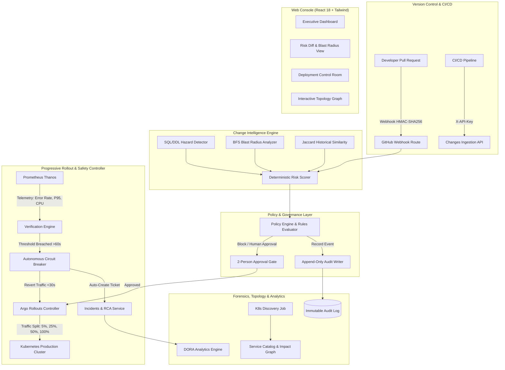

# ChangeGuard — Understanding Implemented Modules (UIM.md)

This document provides a comprehensive technical overview of the **ChangeGuard** platform as built across all 6 development phases specified in [PRD.md](file:///c:/Users/User/Documents/changeguard-Major/PRD.md). It outlines what was built, system capabilities, end-to-end architecture, technical module implementations, and instructions on how to run and verify the platform.

---

## 1. Executive Summary & Purpose

**ChangeGuard** is an enterprise-grade software change risk analysis and autonomous deployment safety platform. It sits between software version control (GitHub/GitLab), CI/CD pipelines (GitHub Actions/Argo), and production Kubernetes clusters to:

1. **Quantify Risk Before Merge**: Analyze incoming code diffs, migrations, and dependencies to compute a deterministic risk score ($0$–$100$) and detect hazardous operations.
2. **Enforce Policy Gates & Governance**: Automatically evaluate organization safety rules (e.g., blocking unindexed schema migrations, requiring two-person review on Tier-1 changes).
3. **Orchestrate Progressive Canary Deployments**: Manage traffic shifting steps ($5\% \rightarrow 25\% \rightarrow 50\% \rightarrow 100\%$) via Argo Rollouts.
4. **Trigger Autonomous Rollbacks in $<30$ Seconds**: Continuously monitor real-time Prometheus telemetry; if an anomaly or threshold breach is sustained, ChangeGuard halts traffic and rolls back to baseline without human intervention.
5. **Auto-Generate Post-Mortems & Audits**: Automatically draft incident reports, root cause analyses (RCA), and maintain an immutable, forensic-grade audit ledger.

--- 

## 2. High-Level System Architecture



---

## 3. Implemented Modules Deep Dive (Phases 1–6)

### Phase 1: Core API Server, Security & Multi-Role RBAC
- **Files**: 
  - [backend/src/server.ts](file:///c:/Users/User/Documents/changeguard-Major/backend/src/server.ts)
  - [backend/src/plugins/errorHandler.ts](file:///c:/Users/User/Documents/changeguard-Major/backend/src/plugins/errorHandler.ts)
  - [backend/src/plugins/auth.ts](file:///c:/Users/User/Documents/changeguard-Major/backend/src/plugins/auth.ts)
  - [backend/src/plugins/rbac.ts](file:///c:/Users/User/Documents/changeguard-Major/backend/src/plugins/rbac.ts)
  - [backend/src/routes/auth.ts](file:///c:/Users/User/Documents/changeguard-Major/backend/src/routes/auth.ts)
  - [backend/src/routes/team.ts](file:///c:/Users/User/Documents/changeguard-Major/backend/src/routes/team.ts)
  - [backend/src/routes/apiKeys.ts](file:///c:/Users/User/Documents/changeguard-Major/backend/src/routes/apiKeys.ts)
  - [backend/src/routes/health.ts](file:///c:/Users/User/Documents/changeguard-Major/backend/src/routes/health.ts)
- **Key Capabilities**:
  - **Fastify Framework Foundation**: High-performance HTTP/1.1 and HTTP/2 engine with CORS, rate limiting (`100 req/min`), and unified error envelopes (`ApiErrorPayload`).
  - **5-Role Enterprise RBAC**: Strict permission matrix across `ADMIN`, `PLATFORM_ENGINEER`, `SRE`, `DEVELOPER`, and `APPROVER`.
  - **Dual Authentication**: 8-hour signed JWT bearer tokens for interactive users + SHA-256 hashed API Keys (`cg_live_xxxx`) for automation.
  - **Health Probes**: `/api/v1/health` (liveness) and `/api/v1/ready` (readiness) for Kubernetes orchestration.

### Phase 2: Change Intelligence & Risk Analysis Engine
- **Files**:
  - [backend/src/services/sqlHazardDetector.ts](file:///c:/Users/User/Documents/changeguard-Major/backend/src/services/sqlHazardDetector.ts)
  - [backend/src/services/blastRadius.ts](file:///c:/Users/User/Documents/changeguard-Major/backend/src/services/blastRadius.ts)
  - [backend/src/services/historicalSimilarity.ts](file:///c:/Users/User/Documents/changeguard-Major/backend/src/services/historicalSimilarity.ts)
  - [backend/src/services/riskScorer.ts](file:///c:/Users/User/Documents/changeguard-Major/backend/src/services/riskScorer.ts)
  - [backend/src/routes/webhook.ts](file:///c:/Users/User/Documents/changeguard-Major/backend/src/routes/webhook.ts)
  - [backend/src/routes/changes.ts](file:///c:/Users/User/Documents/changeguard-Major/backend/src/routes/changes.ts)
- **Key Capabilities**:
  - **SQL Hazard Detection**: Regex engine flagging high-risk operations: `DROP TABLE`, `DROP COLUMN`, table locks without timeout, and `CREATE INDEX` missing `CONCURRENTLY`.
  - **BFS Blast Radius Traversal**: Breadth-first traversal up to depth 3 identifying direct, upstream, and downstream dependencies across services, databases, and message queues.
  - **Jaccard Historical Similarity**: Compares file paths of incoming pull requests with past rollbacks to calculate incident recurrence probabilities.
  - **Deterministic 8-Stage Risk Scorer**: Produces normalized risk score ($0$–$100$) with level classifications (`LOW`, `MEDIUM`, `HIGH`, `CRITICAL`).
  - **Secure Webhook Ingestion**: Validates GitHub HMAC-SHA256 signatures (`X-Hub-Signature-256`) with duplicate delivery suppression.

### Phase 3: Release Policies, Governance & Audit Logging
- **Files**:
  - [backend/src/services/policyEngine.ts](file:///c:/Users/User/Documents/changeguard-Major/backend/src/services/policyEngine.ts)
  - [backend/src/services/auditWriter.ts](file:///c:/Users/User/Documents/changeguard-Major/backend/src/services/auditWriter.ts)
  - [backend/src/routes/policies.ts](file:///c:/Users/User/Documents/changeguard-Major/backend/src/routes/policies.ts)
  - [backend/src/routes/approvals.ts](file:///c:/Users/User/Documents/changeguard-Major/backend/src/routes/approvals.ts)
  - [backend/src/routes/audit.ts](file:///c:/Users/User/Documents/changeguard-Major/backend/src/routes/audit.ts)
- **Key Capabilities**:
  - **Configurable Policy Engine**: Supports numeric and string operators (`>`, `<`, `>=`, `<=`, `==`, `contains`) with actions: `REQUIRE_HUMAN_APPROVAL`, `REQUIRE_CANARY`, `BLOCK_MERGE`, `PAUSE_ROLLOUT`, `ROLLBACK_DEPLOYMENT`.
  - **Enforcement & DRY_RUN Modes**: Evaluates policy impact in dry-run mode before enforcing gates.
  - **Two-Person Approval Rule**: Critical changes require two distinct authorized sign-offs before deployment unblocking.
  - **Immutable Audit Trail & CSV Export**: Append-only audit logger capturing actor, action, timestamp, and metadata; streams CSV downloads.

### Phase 4: Progressive Deployment & Autonomous Response
- **Files**:
  - [backend/src/services/argoClient.ts](file:///c:/Users/User/Documents/changeguard-Major/backend/src/services/argoClient.ts)
  - [backend/src/services/prometheusClient.ts](file:///c:/Users/User/Documents/changeguard-Major/backend/src/services/prometheusClient.ts)
  - [backend/src/services/verificationEngine.ts](file:///c:/Users/User/Documents/changeguard-Major/backend/src/services/verificationEngine.ts)
  - [backend/src/routes/deployments.ts](file:///c:/Users/User/Documents/changeguard-Major/backend/src/routes/deployments.ts)
- **Key Capabilities**:
  - **Argo Rollouts Traffic Shifting**: Controls canary progression through configured steps (`5%` $\rightarrow$ `25%` $\rightarrow$ `50%` $\rightarrow$ `100%`).
  - **Verification Engine & 60s Window**: Polls Prometheus metric signals (`http_error_rate`, `p95_latency`, `cpu_usage`). Sustained breaches ($>60$s) trigger an autonomous pause.
  - **Stale Telemetry Protection**: Signals older than 90 seconds are automatically marked as degraded/failed, preventing silent blind-spot deployments.
  - **Sub-30-Second Autonomous Rollback**: Reverts canary traffic immediately to $0\%$ and restores stable revision upon critical threshold violation.
  - **Concurrency Conflict Guard**: Prevents concurrent duplicate rollbacks by returning HTTP `409 STATE_CONFLICT`.

### Phase 5: Service Reliability, Topology & Incidents
- **Files**:
  - [backend/src/jobs/serviceDiscovery.ts](file:///c:/Users/User/Documents/changeguard-Major/backend/src/jobs/serviceDiscovery.ts)
  - [backend/src/jobs/serviceTelemetrySync.ts](file:///c:/Users/User/Documents/changeguard-Major/backend/src/jobs/serviceTelemetrySync.ts)
  - [backend/src/routes/services.ts](file:///c:/Users/User/Documents/changeguard-Major/backend/src/routes/services.ts)
  - [backend/src/routes/incidents.ts](file:///c:/Users/User/Documents/changeguard-Major/backend/src/routes/incidents.ts)
  - [backend/src/routes/impactGraph.ts](file:///c:/Users/User/Documents/changeguard-Major/backend/src/routes/impactGraph.ts)
- **Key Capabilities**:
  - **Kubernetes Discovery & Telemetry Sync**: Discovers microservice deployments and synchronizes live health from Prometheus.
  - **Multi-Tier Topology Impact Graph**: Maps services, primary database clusters, Kafka queues, and API gateways into node/edge graphs.
  - **Incident Lifecycle Management**: Transitions incidents (`TRIGGERED` $\rightarrow$ `INVESTIGATING` $\rightarrow$ `MITIGATING` $\rightarrow$ `CONTAINED` $\rightarrow$ `RESOLVED`) and generates Root Cause Analysis (RCA) drafts.
  - **Forensic Immutability**: Application-layer and database-layer protection rejecting `UPDATE` or `DELETE` calls on audit records with HTTP `403 PERMISSION_DENIED`.

### Phase 6: Integrations, DORA Analytics & Production Readiness
- **Files**:
  - [backend/src/services/notificationDispatcher.ts](file:///c:/Users/User/Documents/changeguard-Major/backend/src/services/notificationDispatcher.ts)
  - [backend/src/services/saml.ts](file:///c:/Users/User/Documents/changeguard-Major/backend/src/services/saml.ts)
  - [backend/src/routes/settings.ts](file:///c:/Users/User/Documents/changeguard-Major/backend/src/routes/settings.ts)
  - [backend/src/routes/integrations.ts](file:///c:/Users/User/Documents/changeguard-Major/backend/src/routes/integrations.ts)
  - [backend/src/routes/analytics.ts](file:///c:/Users/User/Documents/changeguard-Major/backend/src/routes/analytics.ts)
  - [Dockerfile](file:///c:/Users/User/Documents/changeguard-Major/Dockerfile)
  - [k8s/deployment.yaml](file:///c:/Users/User/Documents/changeguard-Major/k8s/deployment.yaml), [k8s/service.yaml](file:///c:/Users/User/Documents/changeguard-Major/k8s/service.yaml), [k8s/ingress.yaml](file:///c:/Users/User/Documents/changeguard-Major/k8s/ingress.yaml), [k8s/configmap.yaml](file:///c:/Users/User/Documents/changeguard-Major/k8s/configmap.yaml)
  - [.github/workflows/ci.yml](file:///c:/Users/User/Documents/changeguard-Major/.github/workflows/ci.yml)
- **Key Capabilities**:
  - **DORA Metrics Computation**: Computes Deployment Frequency, Lead Time for Changes, Change Failure Rate (CFR), and Mean Time to Recovery (MTTR) from persistent records.
  - **Risk Calibration Scatter**: Compares predicted risk scores against actual production outcomes.
  - **Organization Settings**: Database persistence for General, Security, Environments, Notifications, and AI settings.
  - **Enterprise SAML SSO Callback**: Processes base64 SAML assertions and issues JWT sessions.
  - **Production Packaging**: Multi-stage Dockerfile and production-ready Kubernetes manifests with resource limits and non-root security contexts.

---

## 4. API Endpoints Reference

| Method | Endpoint | Description | Phase |
|---|---|---|:---:|
| `GET` | `/api/v1/health` | Liveness health probe | Phase 1 |
| `GET` | `/api/v1/ready` | Readiness database probe | Phase 1 |
| `POST` | `/api/v1/auth/login` | Email/password or SSO login (returns JWT) | Phase 1 |
| `POST` | `/api/v1/auth/sso/callback` | Process SAML assertion | Phase 6 |
| `GET` | `/api/v1/auth/me` | Current user profile and permissions | Phase 1 |
| `GET` | `/api/v1/team` | Team member roster | Phase 1 |
| `GET` | `/api/v1/api-keys` | List masked API keys | Phase 1 |
| `POST` | `/api/v1/api-keys` | Issue new API key | Phase 1 |
| `DELETE` | `/api/v1/api-keys/:id` | Revoke active API key | Phase 1 |
| `POST` | `/api/v1/webhook/github` | Ingest GitHub webhook with HMAC verification | Phase 2 |
| `GET` | `/api/v1/changes` | List PR changes with risk scores | Phase 2 |
| `GET` | `/api/v1/changes/:id` | Detailed change risk analysis and diff | Phase 2 |
| `POST` | `/api/v1/changes/:id/approve` | Grant governance policy approval | Phase 2 |
| `GET` | `/api/v1/policies` | List active and draft safety policies | Phase 3 |
| `POST` | `/api/v1/policies` | Create safety policy (Admin/Platform Eng) | Phase 3 |
| `GET` | `/api/v1/audit-log` | Filterable audit events | Phase 3 |
| `GET` | `/api/v1/audit-log/export` | Download audit events as CSV | Phase 3 |
| `GET` | `/api/v1/deployments` | List active canary rollouts | Phase 4 |
| `GET` | `/api/v1/deployments/:id` | Deployment detail, gauge, and telemetry history | Phase 4 |
| `POST` | `/api/v1/deployments/:id/promote`| Advance canary stage ($5\% \rightarrow 25\% \rightarrow 50\% \rightarrow 100\%$) | Phase 4 |
| `POST` | `/api/v1/deployments/:id/pause` | Pause traffic progression | Phase 4 |
| `POST` | `/api/v1/deployments/:id/resume` | Resume paused canary rollout | Phase 4 |
| `POST` | `/api/v1/deployments/:id/rollback`| Execute fast rollback to previous baseline | Phase 4 |
| `POST` | `/api/v1/deployments/:id/simulate-failure` | Test circuit breaker threshold trip | Phase 4 |
| `GET` | `/api/v1/services` | Service catalog | Phase 5 |
| `GET` | `/api/v1/services/:id` | Service detail and dependencies | Phase 5 |
| `POST` | `/api/v1/services/sync` | Trigger K8s discovery and Prometheus sync | Phase 5 |
| `GET` | `/api/v1/incidents` | List incident response records | Phase 5 |
| `PATCH` | `/api/v1/incidents/:id/status` | Update incident lifecycle status | Phase 5 |
| `PATCH` | `/api/v1/incidents/:id/rca` | Edit Root Cause Analysis draft | Phase 5 |
| `GET` | `/api/v1/impact-graph` | Full topology node/edge blast radius graph | Phase 5 |
| `GET` | `/api/v1/settings` | Read organization settings | Phase 6 |
| `PATCH` | `/api/v1/settings/:section` | Update General, Security, Notifications, or AI settings | Phase 6 |
| `GET` | `/api/v1/integrations` | List VCS, CI/CD, K8s, and Slack connectors | Phase 6 |
| `POST` | `/api/v1/integrations/:id/test` | Test connectivity to external integration | Phase 6 |
| `GET` | `/api/v1/analytics/dora` | Query official DORA metrics | Phase 6 |
| `GET` | `/api/v1/analytics/summary` | Executive dashboard analytics summary | Phase 6 |
| `GET` | `/api/v1/analytics/risk-calibration`| Score vs. outcome calibration points | Phase 6 |

---

## 5. Automated Test Suite Matrix

ChangeGuard contains **39 automated tests** executed using native Node.js test runner (`node:test` + `node:assert/strict`):

```powershell
cd backend
npm test
```

| Suite | File | Tests | Key Validations |
|---|---|:---:|---|
| **Phase 1** | [authAndRbac.test.ts](file:///c:/Users/User/Documents/changeguard-Major/backend/src/tests/authAndRbac.test.ts) | 8 | Health/Ready probes, JWT signing/expiry, 401 unauthorized protection, 5-role RBAC enforcement, API Key issuance & masking. |
| **Phase 2** | [changeIntelligence.test.ts](file:///c:/Users/User/Documents/changeguard-Major/backend/src/tests/changeIntelligence.test.ts) | 5 | SQL destructive hazard patterns, Jaccard file overlap, HMAC webhook signatures & deduplication, PR changes API. |
| **Phase 3** | [policiesAndGovernance.test.ts](file:///c:/Users/User/Documents/changeguard-Major/backend/src/tests/policiesAndGovernance.test.ts) | 4 | Policy engine operators ($>$, $<$, $==$, contains), rule evaluation, two-person approval gates, audit logging & CSV export. |
| **Phase 4** | [deploymentsAndVerification.test.ts](file:///c:/Users/User/Documents/changeguard-Major/backend/src/tests/deploymentsAndVerification.test.ts) | 6 | Argo canary stages ($5\% \rightarrow 100\%$), stale telemetry detection ($>90$s), circuit breaker pause, autonomous rollback ($<30$s), 409 conflict handling. |
| **Phase 5** | [serviceReliabilityAndIncidents.test.ts](file:///c:/Users/User/Documents/changeguard-Major/backend/src/tests/serviceReliabilityAndIncidents.test.ts) | 5 | Service catalog, K8s discovery job, multi-tier impact graph node types, incident status lifecycle, forensic audit immutability rejection. |
| **Phase 6** | [analyticsAndProduction.test.ts](file:///c:/Users/User/Documents/changeguard-Major/backend/src/tests/analyticsAndProduction.test.ts) | 5 | DORA metrics (CFR formula), settings persistence, integration connectivity check, Slack notification dispatch, SAML SSO callback flow. |
| **Total** | | **39** | **All 39 Pass (100% Success)** |

---

## 6. How to Run and Verify the System

### Prerequisites
- Node.js version $\ge 20.0.0$ (v22 or v24 recommended)
- Git

### Step 1: Start the Backend API Server
```powershell
cd backend
npm run dev
```
The server will bind to `http://0.0.0.0:3000`.

### Step 2: Verify Backend Health (CLI)
In a second terminal:
```powershell
# Health probe
Invoke-RestMethod -Uri "http://localhost:3000/api/v1/health"

# Ready probe
Invoke-RestMethod -Uri "http://localhost:3000/api/v1/ready"

# Authenticated Changes query (using pre-seeded CI API key)
Invoke-RestMethod -Uri "http://localhost:3000/api/v1/changes" -Headers @{ "X-API-Key" = "cg_live_demo123456789" }
```

### Step 3: Start the Web UI
In a third terminal at the root directory:
```powershell
npm run dev
```
Open **[http://localhost:5173](http://localhost:5173)** in your browser.

### Step 4: Full Interactive UI Verification Flow
1. **Executive Dashboard (`/`)**: View deployment risk trends, rollouts, blocked PRs, and active incident counts.
2. **Change Intelligence (`/changes`)**: Open **PR #1824** (`Optimize checkout query & persist idempotency keys`), inspect risk score $78$, SQL hazard detection, blast radius, and historical similarity.
3. **Policies & Governance (`/policies`)**: Inspect rule triggers (`risk_score > 75` $\rightarrow$ `REQUIRE_HUMAN_APPROVAL`).
4. **Deployment Control Room (`/deployments`)**: Select `dep-checkout-284` (`Checkout Service v2.8.4`). Observe the canary gauge and live telemetry charts. Click **Promote** to shift traffic from $5\%$ to $25\%$.
5. **Circuit Breaker Simulation**: Click **Simulate Failure** in the top banner. Error rate jumps to $3.8\%$. Watch the autonomous circuit breaker pause the deployment and trigger incident creation. Click **Rollback** to drop canary exposure to $0\%$.
6. **Incidents & Post-Mortem (`/incidents`)**: Inspect the auto-generated incident, review the LLM-style root cause analysis (RCA) draft, and resolve the ticket.
7. **Impact Graph (`/impact-graph`)**: Explore microservice dependency nodes, databases, message queues, and API gateways.
8. **Audit Log (`/audit-log`)**: Inspect the forensic audit trail and click **Export CSV**.
9. **DORA Analytics (`/analytics`)**: Review Deployment Frequency, Lead Time, Change Failure Rate, and MTTR.
10. **Settings (`/settings`)**: Inspect and test General, Team, Security, Notifications, and AI configurations.
